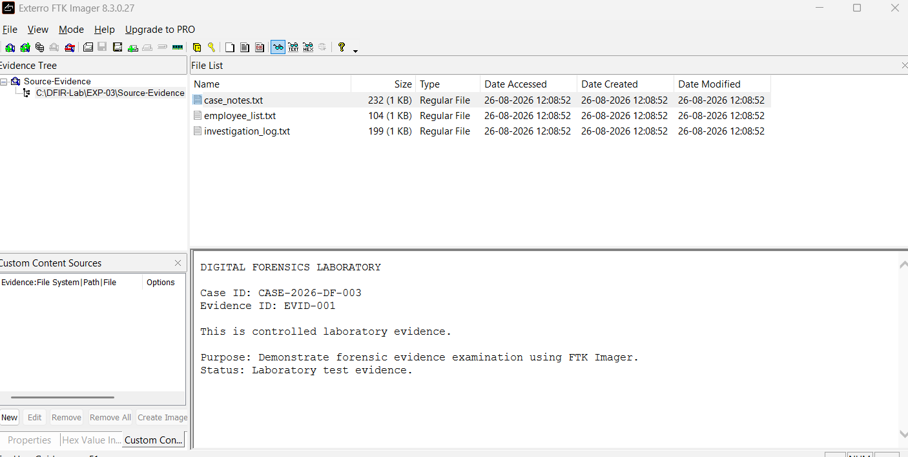
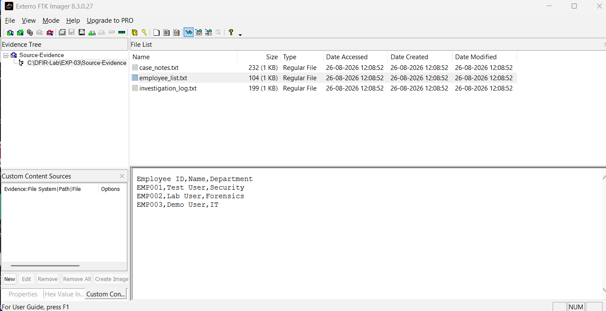
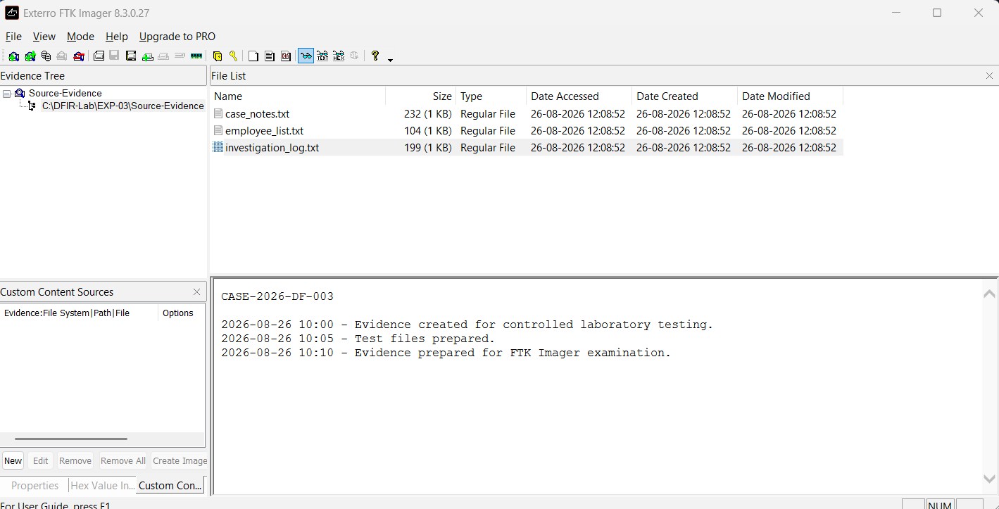
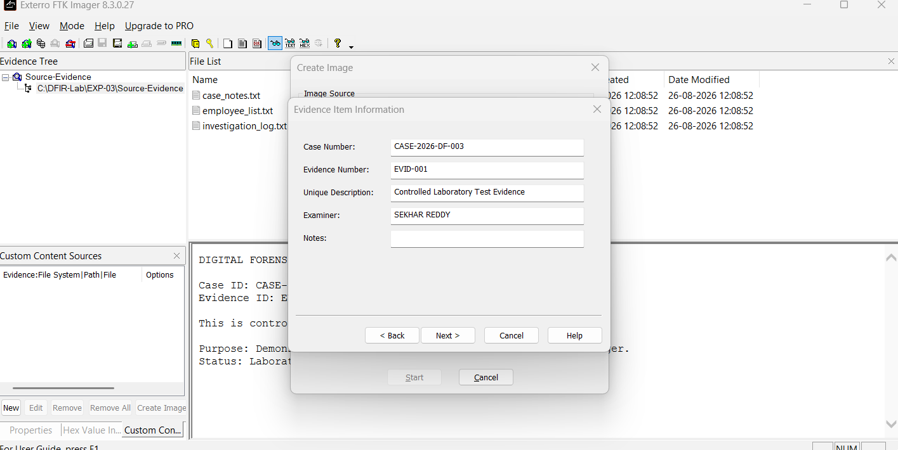
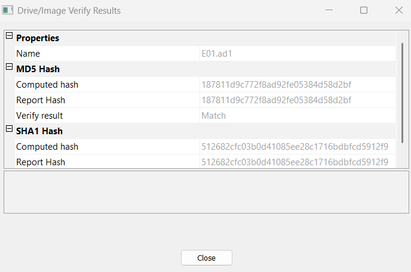
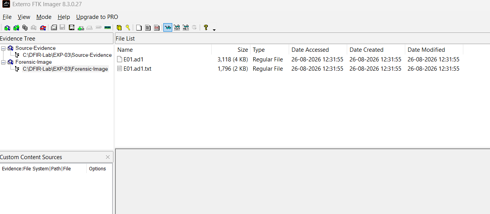
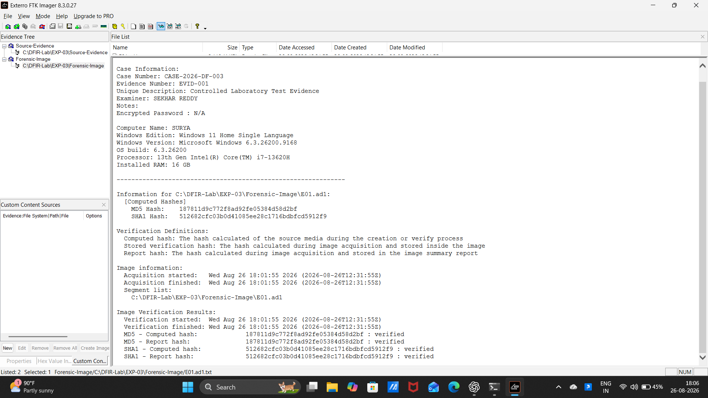

# 🧪 EXPERIMENT 01 — Ex. No 1: Evidence Acquisition Using AccessData FTK Imager

---

## 🎯 Objective

To acquire digital evidence in a forensically sound manner using AccessData FTK Imager, preserve evidentiary integrity, calculate cryptographic hashes (MD5 and SHA-1), and verify image authenticity against source data.

---

## 🧰 Tools / Requirements

- **Forensic Software**: AccessData FTK Imager / Exterro FTK Imager (Version 8.3.0.27)
- **Host Operating System**: Microsoft Windows 11 Home (Build 6.3.26200)
- **Forensic Environment**: Write-blocking methodology / Read-only evidence handling
- **Evidence Storage**: Local directory structure for source and forensic image destination

---

## 📋 Experiment Scenario

> Controlled laboratory evidence was used for this experiment.

A simulated digital forensic acquisition scenario was established to demonstrate the acquisition and verification of digital evidence. The investigator was tasked with importing targeted laboratory evidence items, recording formal case metadata, creating an evidence container (.ad1 image format), and validating evidence integrity via cryptographic hashing.

---

## 🔐 Evidence / Input

- **Source Evidence Path**: C:\DFIR-Lab\EXP-03\Source-Evidence
- **Case Identifier**: CASE-2026-DF-003
- **Evidence Identifier**: EVID-001
- **Investigator / Examiner**: SEKHAR REDDY
- **Evidence Description**: Controlled Laboratory Test Evidence
- **Target Files Acquired**:
  - case_notes.txt (232 bytes / 1 KB)
  - employee_list.txt (104 bytes / 1 KB)
  - investigation_log.txt (199 bytes / 1 KB)

---

## ⚙️ Procedure

### Step 1 — Adding Evidence Item and Previewing Case Notes

The FTK Imager application was launched and the source evidence folder was mounted as a custom content source. The file case_notes.txt was selected in the file list to preview its contents and verify evidentiary details in the lower viewer pane.

---

### Step 2 — Examining Evidence Content — Employee List

The file employee_list.txt was selected from the file list to inspect its contents. The text viewer displayed records of test employee IDs, user roles, and assigned laboratory departments (EMP001, Test User, Security, EMP002, Lab User, Forensics, EMP003, Demo User, IT).

---

### Step 3 — Examining Evidence Content — Investigation Log

The file investigation_log.txt was inspected to confirm timestamps and event records created during the controlled test setup.

---

### Step 4 — Creating Forensic Image and Entering Case Metadata

The *Create Image* function was initiated. In the **Evidence Item Information** dialog, official forensic case metadata was entered:
- **Case Number**: CASE-2026-DF-003
- **Evidence Number**: EVID-001
- **Unique Description**: Controlled Laboratory Test Evidence
- **Examiner**: SEKHAR REDDY
- **Notes**: [None]

---

### Step 5 — Forensic Image Verification Results

The evidence acquisition and post-creation verification processes were executed. The **Drive/Image Verify Results** window confirmed successful completion:
- **Target Image**: E01.ad1
- **MD5 Computed Hash**: 187811d9c772f8ad92fe05384d58d2bf
- **MD5 Report Hash**: 187811d9c772f8ad92fe05384d58d2bf
- **MD5 Verification Result**: Match
- **SHA1 Computed Hash**: 512682cfc03b0d41085ee28c1716bdbfcd5912f9
- **SHA1 Report Hash**: 512682cfc03b0d41085ee28c1716bdbfcd5912f9

---

### Step 6 — Reviewing Acquired Forensic Image in Evidence Tree

The generated forensic image directory C:\DFIR-Lab\EXP-03\Forensic-Image was added to the FTK Imager evidence tree. The folder structure revealed:
- E01.ad1 (Forensic Image container — 3,118 bytes)
- E01.ad1.txt (Forensic Acquisition and Verification Log — 1,796 bytes)

---

### Step 7 — Examining Acquisition and Verification Summary Report

The generated acquisition summary report E01.ad1.txt was loaded and examined in FTK Imager. The log documented complete hardware and environment details (Host: SURYA, Windows 11 Build 6.3.26200, Intel Core i7-13620H, 16 GB RAM), timestamps (Wed Aug 26 18:01:55 2026), and verified MD5 and SHA-1 hash calculations.

---

## 🔎 Observations

1. The source files were loaded into FTK Imager without altering file attributes or timestamps.
2. The image creation wizard allowed input of case metadata (CASE-2026-DF-003, Examiner: SEKHAR REDDY).
3. An .ad1 evidence container (E01.ad1) and its associated log (E01.ad1.txt) were successfully created in C:\DFIR-Lab\EXP-03\Forensic-Image.
4. Cryptographic MD5 hash computed was 187811d9c772f8ad92fe05384d58d2bf (Match).
5. Cryptographic SHA-1 hash computed was 512682cfc03b0d41085ee28c1716bdbfcd5912f9 (Match).

---

## 🧠 Findings

- **Data Integrity Assurance**: The computed MD5 and SHA-1 hashes of the acquired image match the reported source hashes exactly, proving that no data modification or corruption occurred during acquisition.
- **Forensic Soundness**: The use of structured metadata and automated verification logs establishes a defensible chain of custody and forensic record for the acquired container.

---

## 📊 Result

✅ Successfully completed

The evidence acquisition process was executed in AccessData/Exterro FTK Imager with complete case metadata and verified MD5/SHA-1 cryptographic integrity.

---

## 📝 Conclusion

FTK Imager successfully acquired the designated laboratory evidence into a forensically sound image format (.ad1). Both MD5 and SHA-1 verification hashes confirmed bitstream integrity and preservation of evidence.

---

## 📚 References

- AccessData FTK Imager User Guide
- Laboratory Manual: Ex.No.1 FTK Imager.docx
