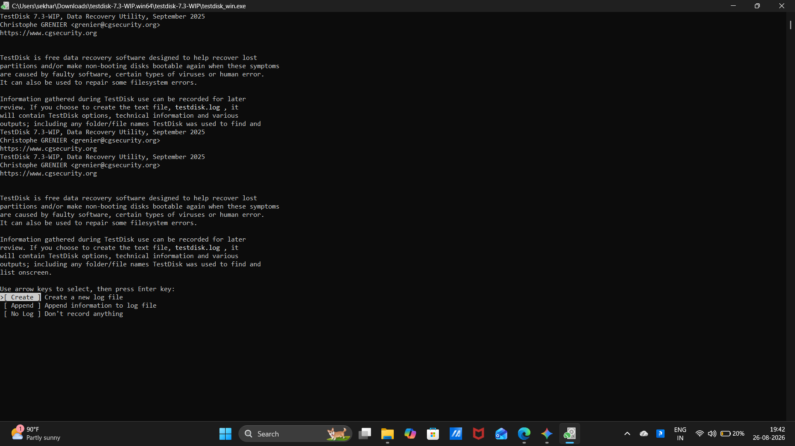
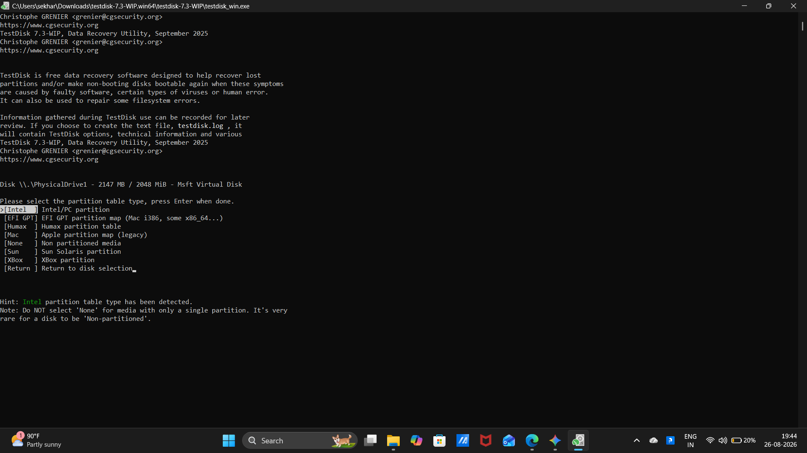
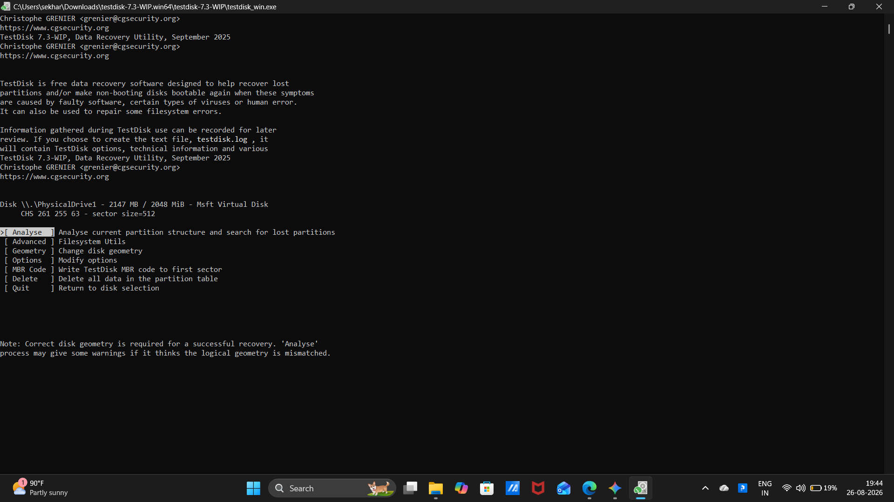
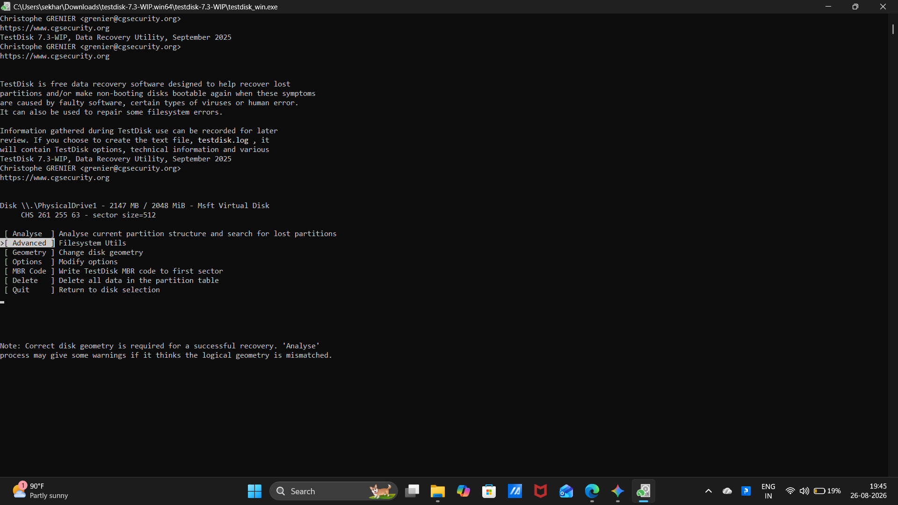
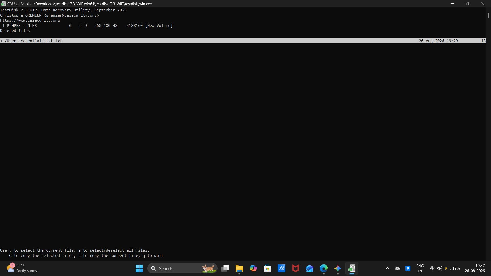
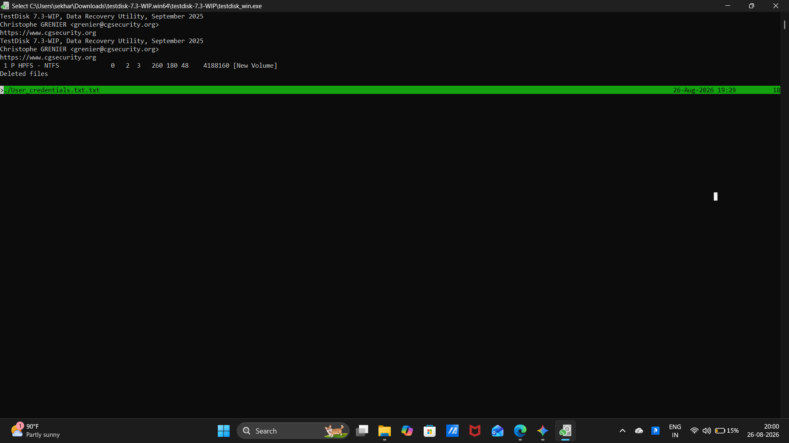
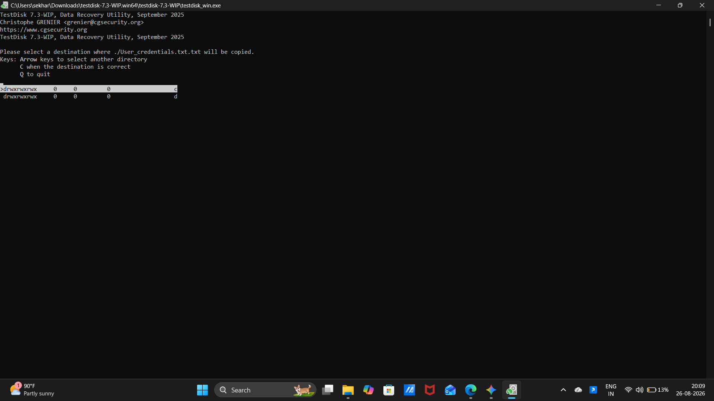
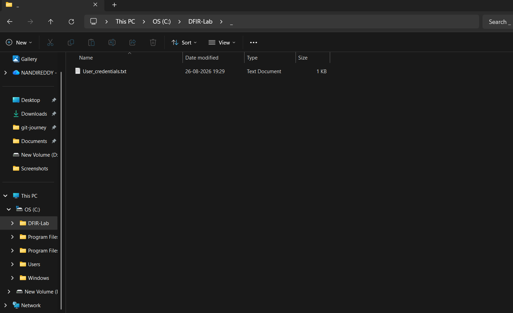

# 🧪 EXPERIMENT 02 — Ex.No:2 Recover deleted or damaged files from a storage device using Test Disk

---

## 🎯 Objective

To recover deleted or damaged files from a storage device, analyze partition table structures, and restore lost data to a secure location using TestDisk.

---

## 🪀 Tools / Requirements

- **Forensic Software**: TestDisk 7.3-WIP (Data Recovery Utility, Christophe GRENIER)
- **Host Operating System**: Microsoft Windows 11
- **Storage Disk / Target Volume**: Virtual storage disk volume (\\.\PhysicalDrive1 — 2147 MB / 2048 MiB NTFS volume [New Volume])

---

## 📋 Experiment Scenario

> Controlled laboratory evidence was used for this experiment.

A storage volume was configured with a deleted test credential document (User_credentials.txt.txt). The forensic investigator was tasked with launching TestDisk, evaluating the partition table architecture, analyzing the volume structure, locating deleted file records from the Master File Table / directory index, and recovering the deleted artifact to a designated forensic directory without modifying the original evidence.

---

## 🔐 Evidence / Input

- **Target Storage Volume**: Disk \\.\PhysicalDrive1 - 2147 MB / 2048 MiB - Msft Virtual Disk
- **Partition Structure**: 1 P HPFS - NTFS (CHS 261 255 63, Sector size 512, [New Volume])
- **Target Deleted Artifact**: ./User_credentials.txt.txt (Size: 18 bytes, Deleted Timestamp: 26-Aug-2026 19:29)
- **Recovery Destination Path**: C:\DFIR-Lab\

---

## ⚙️ Procedure

### Step 1 — TestDisk Initialization and Log File Creation

The TestDisk executable (	estdisk_win.exe) was launched with administrative privileges. The option [ Create ] Create a new log file was selected to record diagnostic messages and recovery actions in 	estdisk.log.

---

### Step 2 — Storage Device and Partition Table Type Selection

The target virtual storage disk Disk \\.\PhysicalDrive1 (Msft Virtual Disk, 2048 MiB) was selected. The partition table type was set to [Intel ] Intel/PC partition based on automated architecture detection.

---

### Step 3 — Current Partition Structure Analysis

The [ Analyse ] function was selected to inspect the volume geometry, check partition boundaries, and search for lost partitions.

---

### Step 4 — Navigating Advanced Filesystem Utilities

The [ Advanced ] Filesystem Utils menu was accessed to interact with filesystem-specific recovery mechanisms for the NTFS partition.

---

### Step 5 — Inspecting Deleted Files on NTFS Volume

The undelete utility parsed the directory index and listed deleted file entries on [New Volume]. The deleted file ./User_credentials.txt.txt (18 bytes, deleted 26-Aug-2026 19:29) was discovered.

---

### Step 6 — Selecting File for Extraction and Recovery

The target artifact ./User_credentials.txt.txt was selected and highlighted in green to prepare for copying out of unallocated space.

---

### Step 7 — Choosing Secure Recovery Destination Directory

The destination drive path c was chosen to safely write out the recovered file outside the source storage volume.

---

### Step 8 — Verifying Recovered File in File Explorer

Windows File Explorer was opened to confirm successful restoration. The recovered file User_credentials.txt (1 KB, modified 26-08-2026 19:29) was verified inside C:\DFIR-Lab\.

---

## 🔎 Observations

1. TestDisk accurately identified the virtual storage disk \\.\PhysicalDrive1 (2048 MiB).
2. The NTFS volume structure was recognized at CHS 261 255 63 ([New Volume]).
3. The deleted file entry ./User_credentials.txt.txt was discovered with intact metadata (18 bytes).
4. The file was copied to C:\DFIR-Lab\ and verified in File Explorer.

---

## 🧠 Findings

- **MFT Record Preservation**: The NTFS file record remained intact in the Master File Table / directory index prior to cluster reallocation.
- **Forensic Recovery Integrity**: TestDisk successfully extracted and restored the deleted text file without altering the source volume structure.

---

## 📊 Result

✅ Successfully completed

The deleted credential artifact was located on the NTFS storage volume, extracted, and successfully restored to C:\DFIR-Lab\.

---

## 📝 Conclusion

TestDisk successfully identified the partition structure, scanned for deleted records, and recovered the lost text document to the forensic directory.

---

## 📚 References

- TestDisk Documentation (CGSecurity)
- Laboratory Manual: Ex.No.2 TestDisk.docx
