# 🧪 EXPERIMENT 03 — Password Capturing

---

## 🎯 Objective

To capture and analyze network traffic using Wireshark network protocol analyzer, inspect communication protocols, evaluate packet headers across network layers, and analyze data streams for credential exposure and encryption posture.

---

## 🧰 Tools / Requirements

- **Forensic Software**: Wireshark Network Protocol Analyzer (Versions 4.6.4 and 4.6.8)
- **Operating Environments**: Linux Virtual Machine / Microsoft Windows 11
- **Network Interface**: Wireless Network Adapter (`Wi-Fi` / `enp0s3`)

---

## 📋 Experiment Scenario

> Controlled laboratory evidence was used for this experiment.

A packet sniffing and protocol analysis scenario was executed to evaluate network traffic on active interfaces. The investigator captured live packets, applied display filters (`dns`, `ip`, `tcp`, `udp`), analyzed deep frame headers across OSI layers, followed TCP streams, and examined the protocol distribution hierarchy.

---

## 🔐 Evidence / Input

- **Capture Interface**: `Wi-Fi` (`\Device\NPF_{37BBBAAB-CB2A-4351-9D61-0CA28A47E4ED}`)
- **Local Host IP / MAC**: `192.168.1.37` / `58:02:05:4c:2f:b8`
- **Total Packets Captured**: 755 packets (536 TCP/TLS packets analyzed)
- **Target Protocols**: Ethernet II, IPv4, IPv6, TCP, UDP, DNS, TLSv1.2, SSDP

---

## ⚙️ Procedure

### Step 1 — Wireshark Interface Selection in Linux Virtual Machine

Wireshark 4.6.4 was launched in a Linux virtual environment to examine available capture interfaces, highlighting network adapter `enp0s3`.

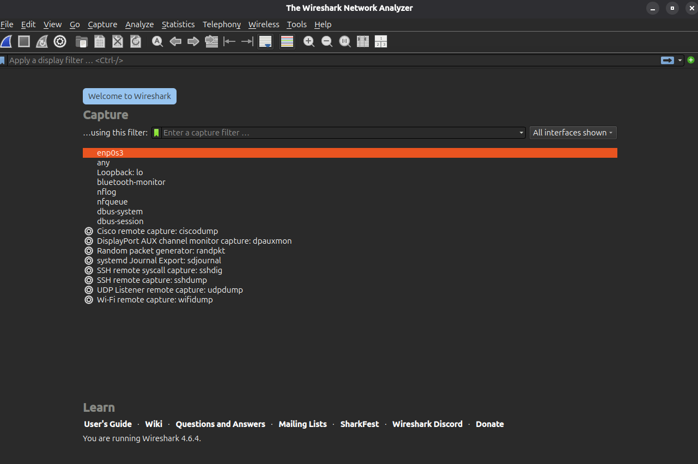

---

### Step 2 — Wireshark Initialization on Windows Host

Wireshark 4.6.8 was opened on the Windows host, displaying active interface traffic activity graphs on the `Wi-Fi` adapter (IP `169.254.93.188` / `fe80::b38c:733c:d43:1aea`).

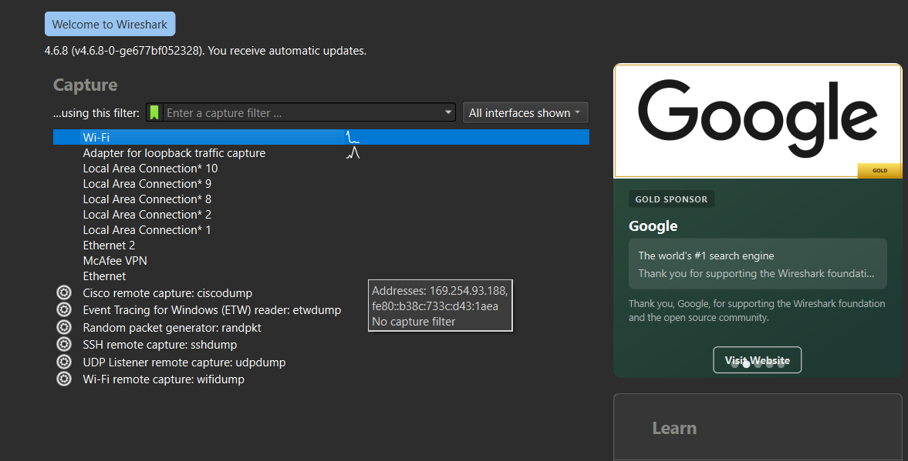

---

### Step 3 — Initiating Live Packet Capture on Wi-Fi Interface

Packet capturing was initiated on the `Wi-Fi` interface. Live network traffic involving local host `192.168.1.37` and external nodes was captured in real time.

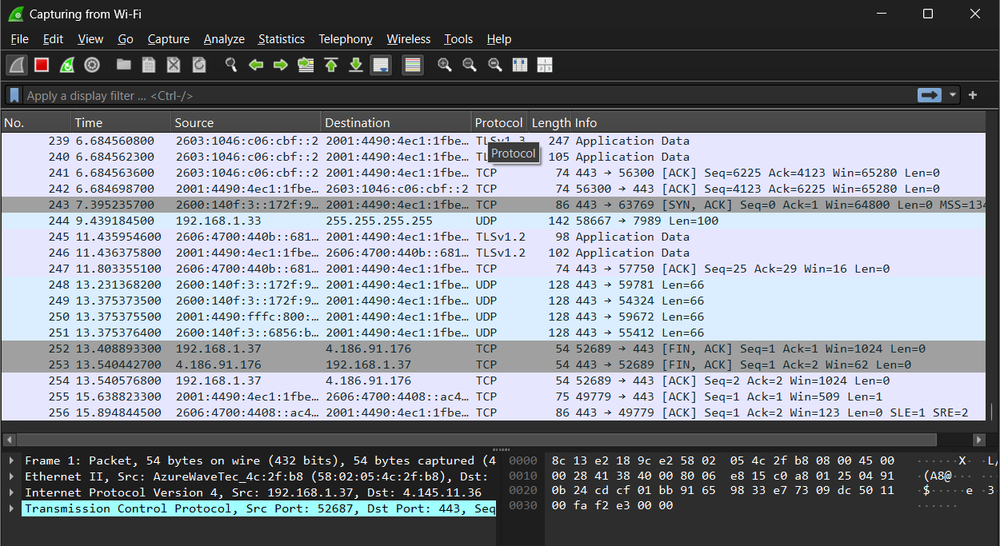

---

### Step 4 — Overview of Captured Transmission Frames

Captured packets were reviewed, showing standard TCP three-way handshake segments, TLSv1.2 Server Hello, Client Key Exchange, and connection termination flags (FIN/ACK, RST/ACK).

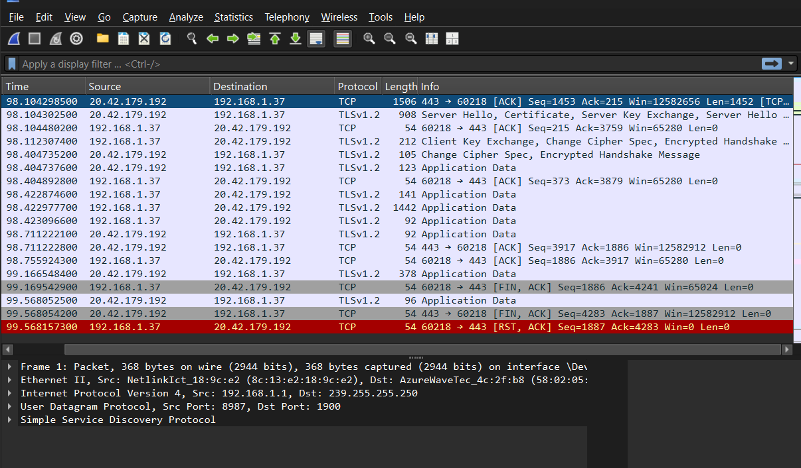

---

### Step 5 — Filtering DNS Protocol Queries and Responses

The display filter `dns` was applied to isolate domain name resolution traffic, identifying standard queries and A/AAAA responses for `google.com`, `chatgpt.com`, and `github.com`.

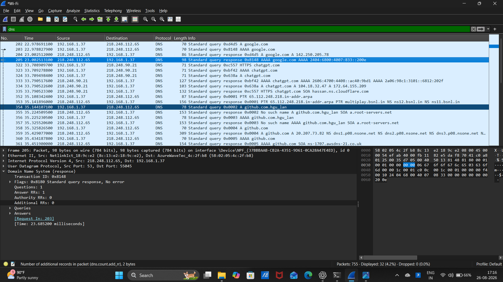

---

### Step 6 — Filtering Internet Protocol (IPv4/IPv6) Traffic

The display filter `ip` was applied to filter network-layer packets between local gateway `192.168.1.1`, host `192.168.1.37`, and DNS resolvers (`218.248.112.65`).

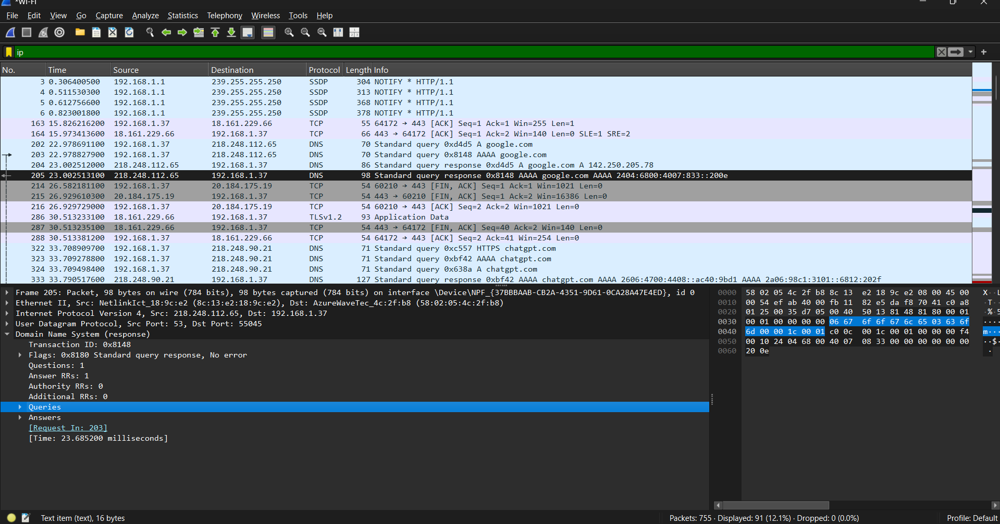

---

### Step 7 — Filtering Transmission Control Protocol (TCP) Streams

The display filter `tcp` was applied to analyze transport-layer communication streams, TCP sequence/acknowledgment numbers, and reassembled TCP PDUs.

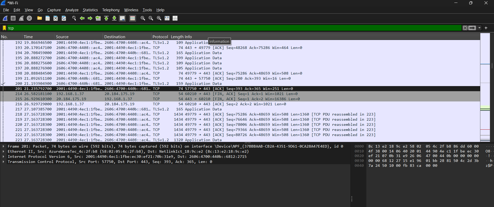

---

### Step 8 — Filtering User Datagram Protocol (UDP) Traffic

The display filter `udp` was applied to inspect connectionless datagram traffic, revealing Simple Service Discovery Protocol (SSDP) multicast notifications on destination `239.255.255.250:1900`.

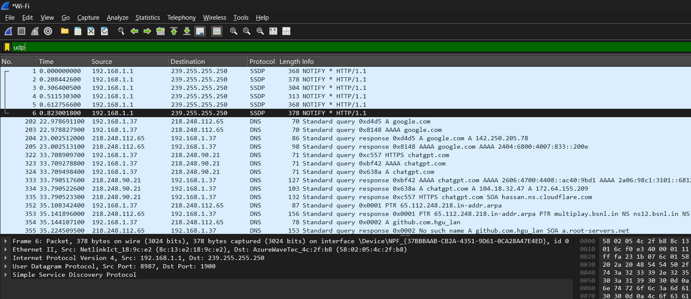

---

### Step 9 — Deep Packet Inspection of Transport Layer Security Frame

Packet 14 was selected to examine detailed header fields: Frame (1132 bytes), Ethernet II, IPv6 (`2001:4490:4ec1:...`), TCP (Port 49779 -> 443), and 5 Reassembled TCP Segments (6498 bytes) under TLS.

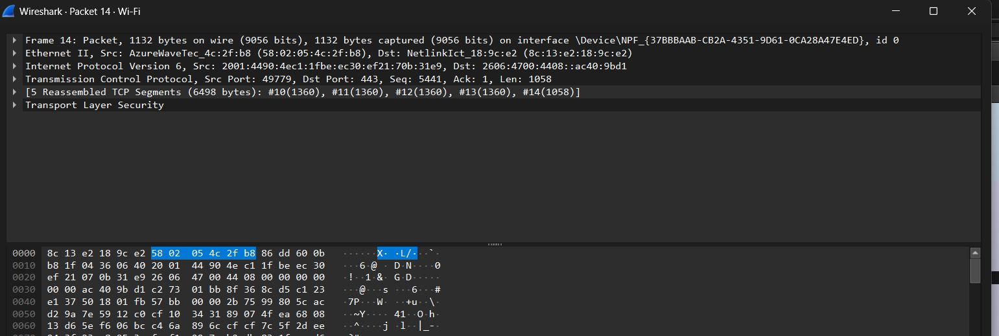

---

### Step 10 — Following TCP Stream Application Payload

The *Follow TCP Stream* feature (`tcp.stream eq 1`) was executed to inspect the raw data stream. The stream payload confirmed active cryptographic encryption preventing plaintext credential extraction.

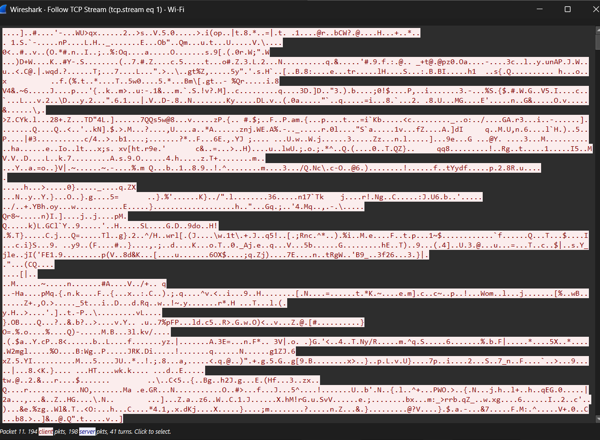

---

### Step 11 — Protocol Hierarchy Statistics Analysis

The *Protocol Hierarchy Statistics* window was opened, detailing packet distribution: 100% Ethernet/IPv6/TCP traffic, with Transport Layer Security (TLS) accounting for 90.6% of transmitted bytes.

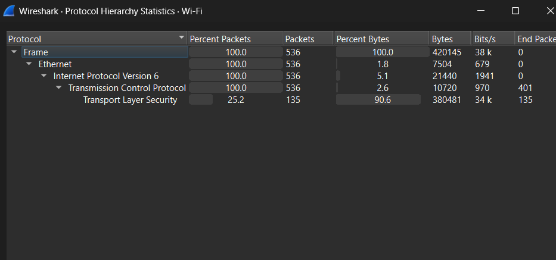

---

## 🔎 Observations

1. 755 total packets were captured across the active Wi-Fi interface.
2. DNS resolution traffic tracked standard queries and responses for `google.com`, `chatgpt.com`, and `github.com`.
3. Transport Layer Security (TLS) represented 90.6% of network traffic payload.
4. Following TCP Stream displayed encrypted cryptographic ciphertexts rather than plaintext form inputs.

---

## 🧠 Findings

- **[MANUAL/SCREENSHOT DISCREPANCY]**: The laboratory manual outlines capturing plaintext HTTP credentials (`http.request.method == "POST"`). In the empirical capture session, modern web services used HTTPS/TLS encryption over port 443. Consequently, data payloads were encrypted, preventing plaintext credential interception and demonstrating the forensic impact of transport layer encryption.
- **Protocol Analysis Capability**: Wireshark effectively dissected traffic across OSI layers 2 through 7 (Ethernet II -> IPv4/IPv6 -> TCP/UDP -> TLS/DNS).

---

## 📊 Result

✅ Successfully completed

Wireshark successfully captured live network packets, filtered protocols across layers 3–7, analyzed stream payloads, and generated protocol hierarchy statistics.

---

## 📝 Conclusion

Wireshark captured and analyzed live network traffic across multiple protocols. Inspection of the TCP streams and protocol hierarchy statistics demonstrated that active TLS encryption protected application payloads from plaintext credential sniffing.

---

## 📚 References

- Wireshark User's Guide (Wireshark Foundation)
- Laboratory Manual: `Ex.No.3 Wireshark.docx`
