# 🧪 EXPERIMENT 04 — Ex. No 4: Analyze email headers and detect email spoofing using MHA (Mail Header Analyzer)

---

## 🎯 Objective

To access, extract, and analyze raw email internet headers, trace routing MTA servers via `Received:` fields, verify email authentication mechanisms (SPF, DKIM, DMARC), and evaluate potential email spoofing.

---

## 🧰 Tools / Requirements

- **Email Platform / Client**: Gmail Web Interface
- **Analysis Tools**: Text Editor (Notepad) / Visual Email Header Inspection
- **Online Verification Utilities**: IP Geolocation & WHOIS Lookup (WhatIsMyIP / LookIP.net)

---

## 📋 Experiment Scenario

> Controlled laboratory evidence was used for this experiment.

An institutional email communication was analyzed to determine authenticity, trace transmission infrastructure, and identify potential spoofing indicators. The investigator accessed the RFC 822 / MIME header, parsed MTA intermediate routing hops, executed IP lookup on origin servers, and verified cryptographic SPF, DKIM, and DMARC alignment.

---

## 🔐 Evidence / Input

- **Target Evidence File**: `GATE 2027 & JAM 2027 Examinations - Reg.eml`
- **Sender Address**: `"Dr. R. Raja Subramanian HOD-CSE" <hodcse@klu.ac.in>`
- **Recipient Address**: `csegrp@klu.ac.in`, `2024cse@klu.ac.in`, `2023cse@klu.ac.in`, `2025cse@klu.ac.in`
- **Message-ID**: `<CAMq6mVb2KZH-MSBe-cAKSiLSC1EU41MSv0o6e5-j5=cObjpLXg@mail.gmail.com>`
- **Delivery Time**: `Tue, Aug 25, 2026 at 6:31 PM (Delivered after 23 seconds)`
- **Sending MTA Host IP**: `209.85.220.69` / `209.85.220.41`

---

## ⚙️ Procedure

### Step 1 — Accessing the Email in Mail Client

The target email ("Fwd: GATE 2027 & JAM 2027 Examinations - Reg") was opened in the Gmail interface to inspect sender headers, delivery details, and message context.

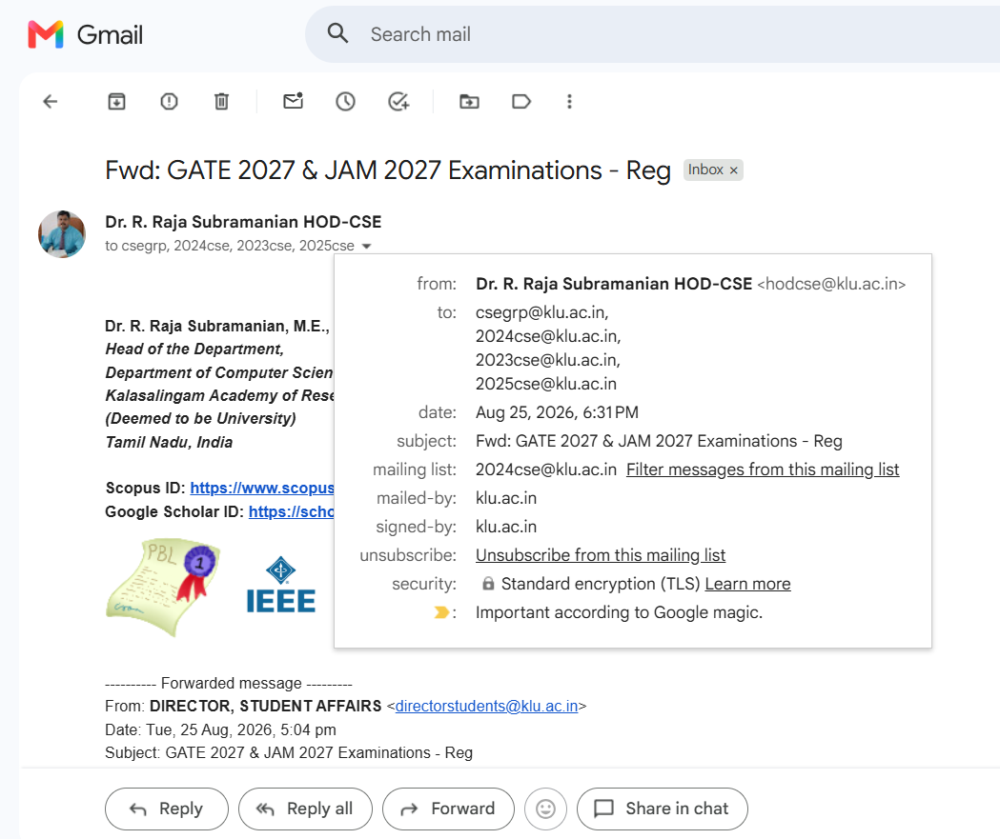

---

### Step 2 — Viewing Original Message Metadata

The *Show original* option was selected from the message menu, opening the RFC header overview displaying Message ID, creation timestamp, From, and To fields.

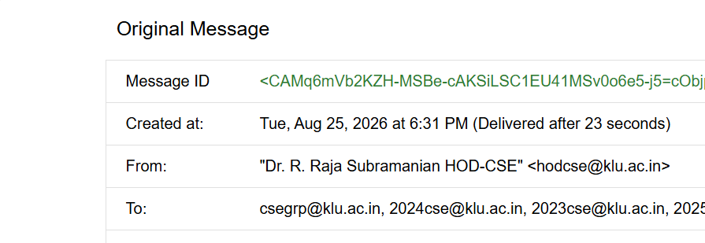

---

### Step 3 — Inspecting Mail Authentication Overview

The authentication overview table was evaluated:
- **SPF**: `PASS with IP 209.85.220.69`
- **DKIM**: `'PASS' with domain klu.ac.in`
- **DMARC**: `'PASS'`

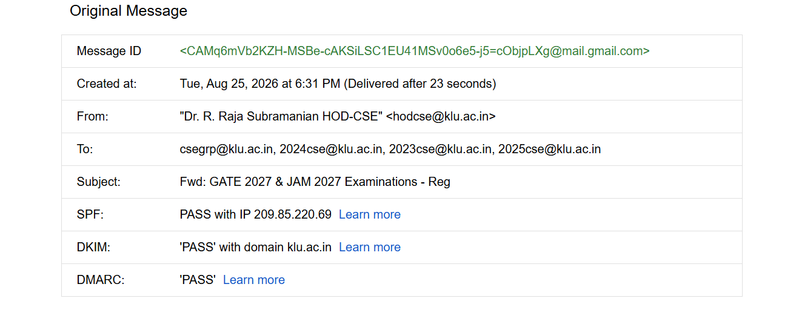

---

### Step 4 — Extracting Full RFC 822 Raw Headers

The complete original raw MIME header was displayed with *Download Original* and *Copy to clipboard* controls for detailed offline forensic parsing.

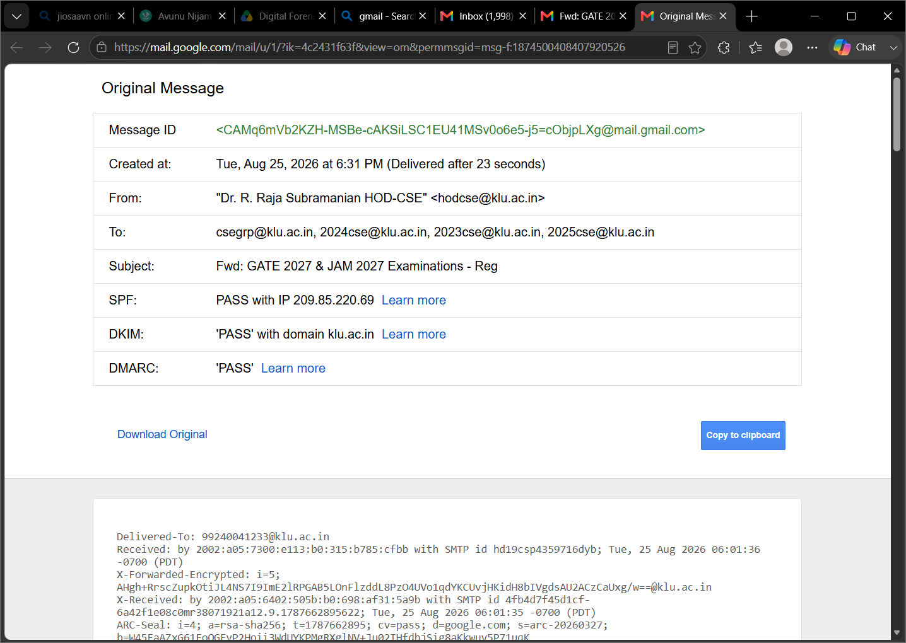

---

### Step 5 — Analyzing Primary Receiving MTA Hop

The raw header was pasted into a text editor (`email-header.txt`). The top `Received:` line (`Received: by 2002:a05:7300:e113:b0:315:b785:cfbb with SMTP id...`) was examined to confirm the final delivering MTA and ARC security seal.

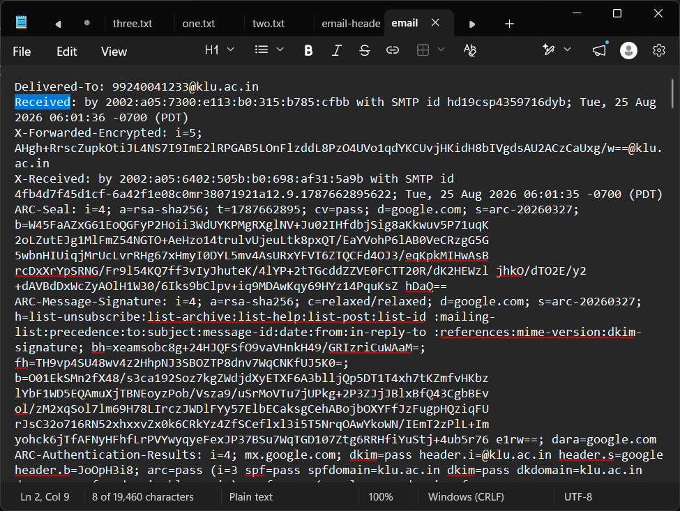

---

### Step 6 — Reviewing Comprehensive Header Stream

The entire structured header stream was analyzed to verify the chronological relay sequence across intermediate mail transfer agents.

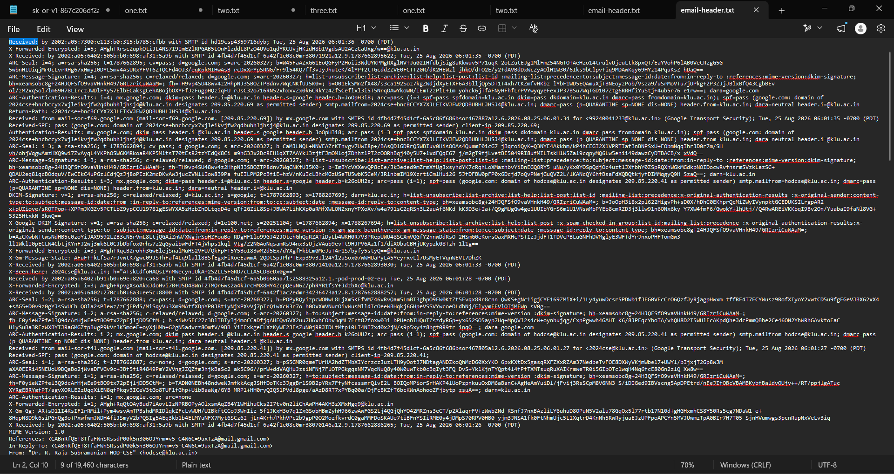

---

### Step 7 — Detailed Inspection of Initial SMTP Hop

A focused examination of the initial receiving hop was conducted to verify protocol compliance (`SMTP id hd19csp4359716dyb; Tue, 25 Aug 2026 06:01:36 -0700`).

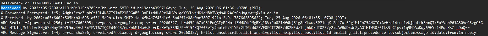

---

### Step 8 — Identifying Key Header Fields

Key forensic metadata fields were cataloged from the header:
- `From: "Dr. R. Raja Subramanian HOD-CSE" <hodcse@klu.ac.in>`
- `Subject: Fwd: GATE 2027 & JAM 2027 Examinations - Reg`
- `Date: Tue, 25 Aug 2026 18:31:12 +0530`
- `Message-ID: <CAMq6mVb2KZH-MSBe-cAKSiLSC1EU41MSv0o6e5-j5=cObjpLXg@mail.gmail.com>`

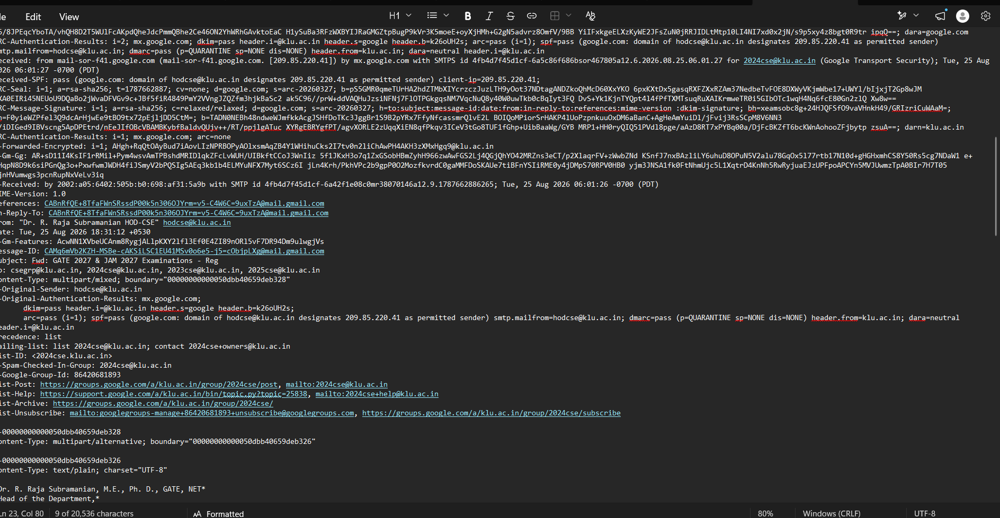

---

### Step 9 — Geolocation and WHOIS IP Lookup of Sending Server

The sending relay IP address `209.85.220.69` was queried through an online IP lookup service, confirming:
- **Owner/ISP**: Google LLC
- **ASN**: AS15169
- **CIDR Block**: 209.85.208.0/20
- **Location**: Utica, New York, United States

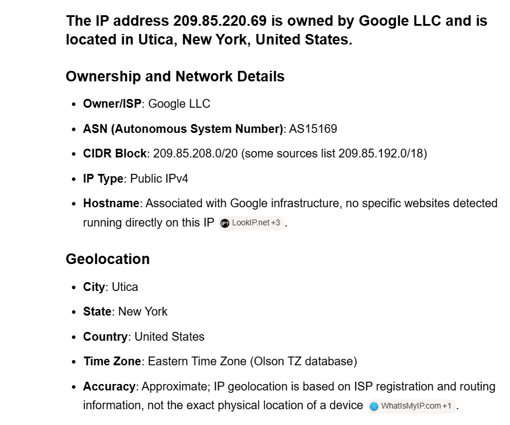

---

### Step 10 — Evaluating Sender Policy Framework (SPF) Status

The SPF authentication record in the header was verified:
`spf=pass (google.com: domain of hodcse@klu.ac.in designates 209.85.220.41 as permitted sender)`

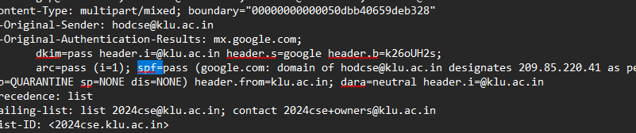

---

### Step 11 — Verifying DomainKeys Identified Mail (DKIM) Signature

The DKIM cryptographic signature header was evaluated:
`DKIM-Signature: v=1; a=rsa-sha256; c=relaxed/relaxed; d=klu.ac.in; s=google;`
Confirming signature validity and body hash integrity.

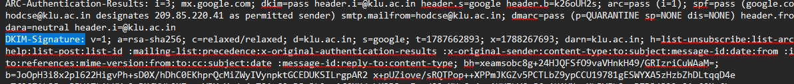

---

### Step 12 — Examining Message-ID and ARC Authentication Seal

The ARC (Authenticated Received Chain) signature and `message-id` header references were analyzed to confirm end-to-end chain verification across forwarding hops.

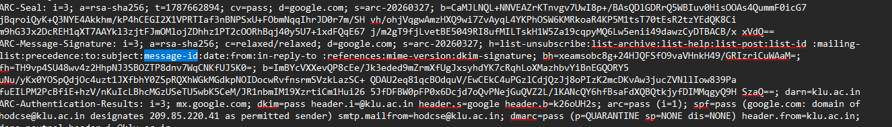

---

## 🔎 Observations

1. Message traveled through authorized Google Workspace mail transfer agents in 23 seconds.
2. SPF authentication evaluated to `PASS` for sending IP `209.85.220.69` / `209.85.220.41`.
3. DKIM cryptographic signature was signed by `d=klu.ac.in` and validated as `PASS`.
4. DMARC policy evaluated to `PASS`.
5. IP lookup for `209.85.220.69` verified ownership by Google LLC (AS15169).

---

## 🧠 Findings

- **Authentication Alignment**: Complete alignment between the visible sender (`hodcse@klu.ac.in`), SPF permitted sender IP block, and DKIM cryptographic signature (`d=klu.ac.in`) verifies email authenticity.
- **Absence of Spoofing**: No anomalous routing hops, header modifications, or domain impersonation indicators were present.

---

## 📊 Result

✅ Successfully completed

The email header was extracted, parsed, and verified. SPF, DKIM, and DMARC checks confirmed message authenticity without spoofing.

---

## 📝 Conclusion

Header analysis confirmed that the email originated from an authorized Google Workspace mail server for domain `klu.ac.in`. Cryptographic authentication mechanisms (SPF, DKIM, DMARC) verified header and content integrity.

---

## 📚 References

- RFC 5322 (Internet Message Format)
- RFC 7208 (Sender Policy Framework)
- RFC 6376 (DomainKeys Identified Mail)
- RFC 7489 (DMARC)
- Laboratory Manual: `Ex. No.4 MHA.docx`
