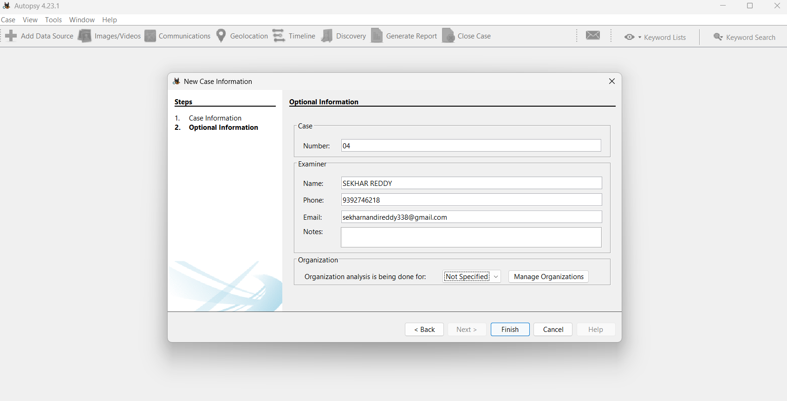
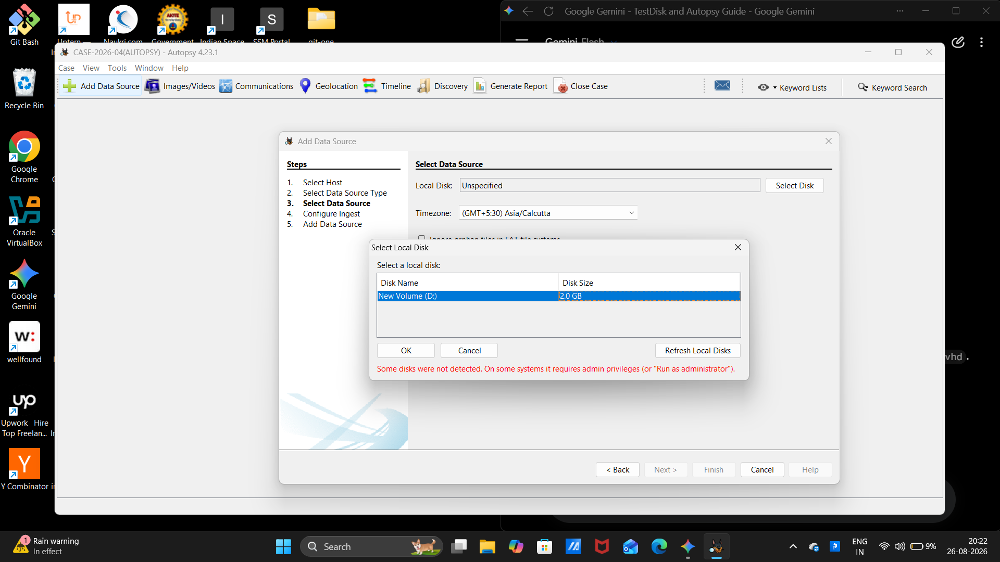
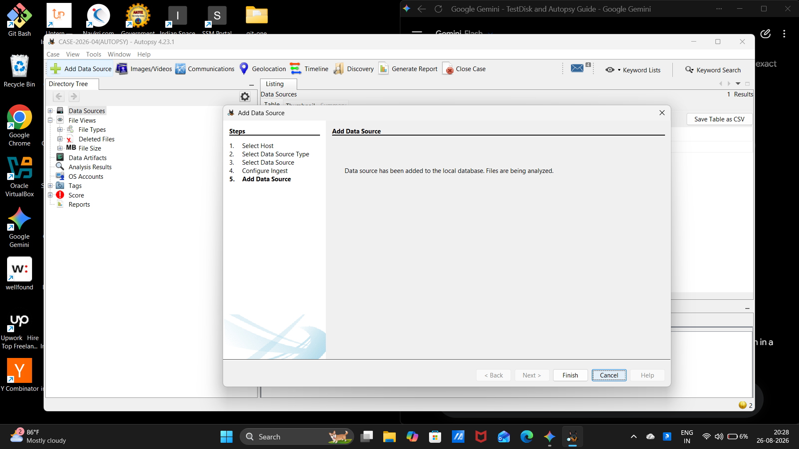
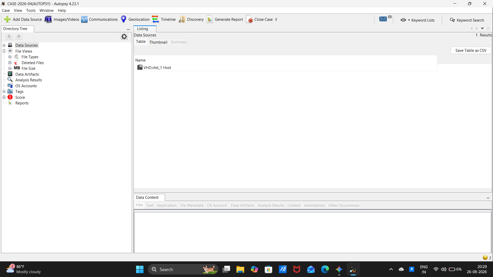
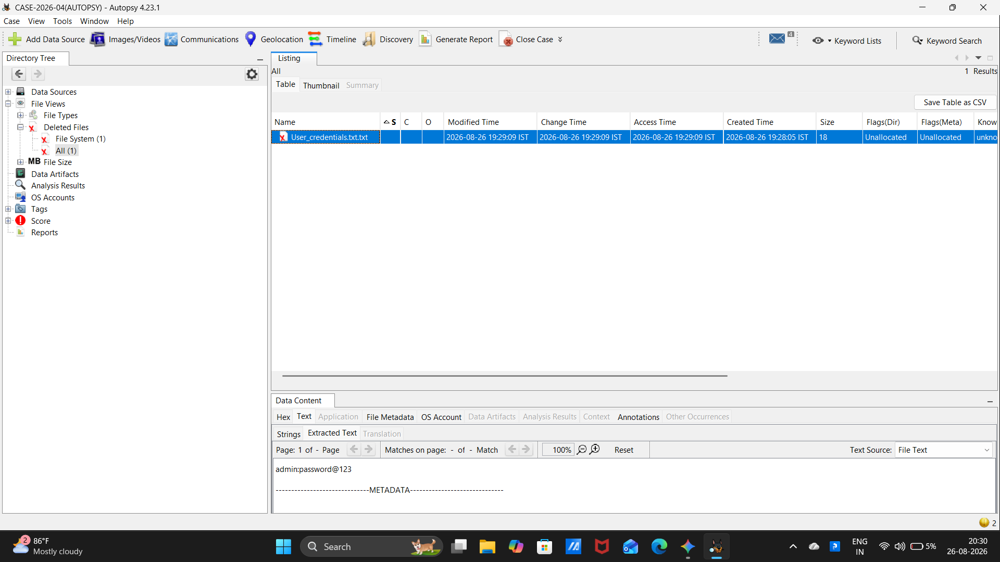
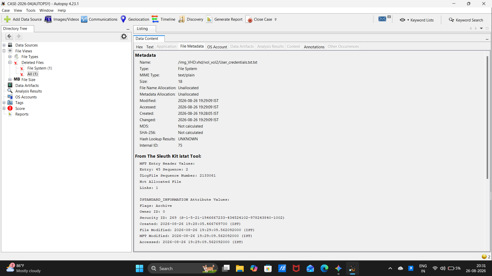
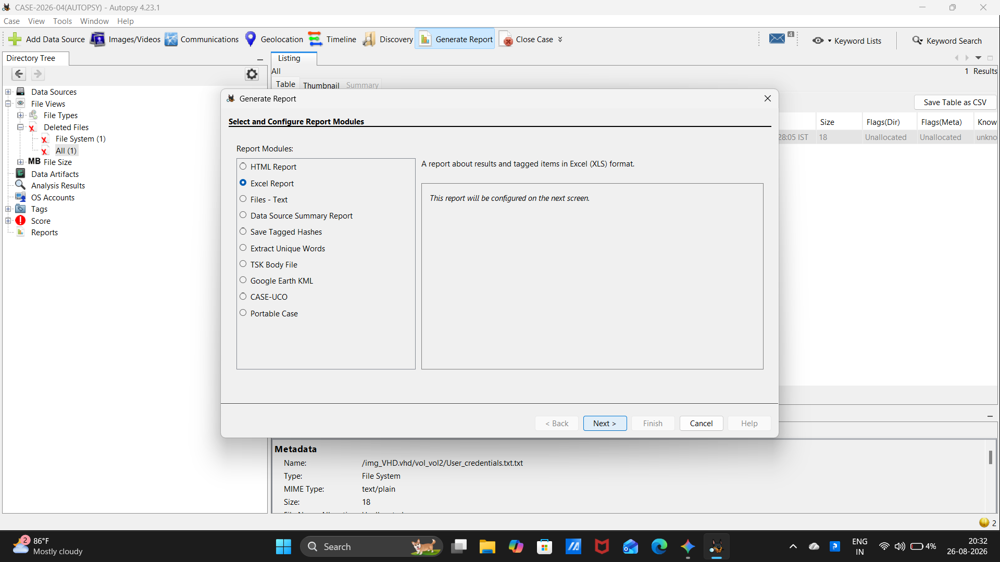
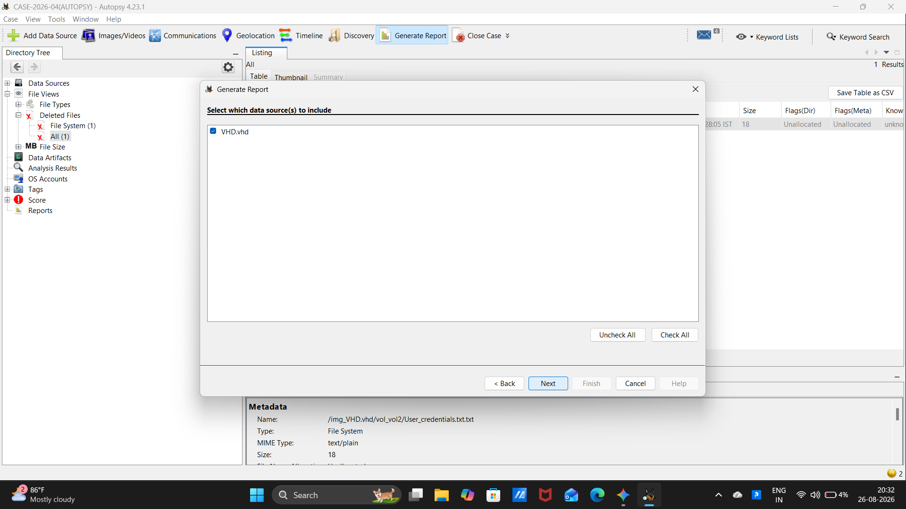
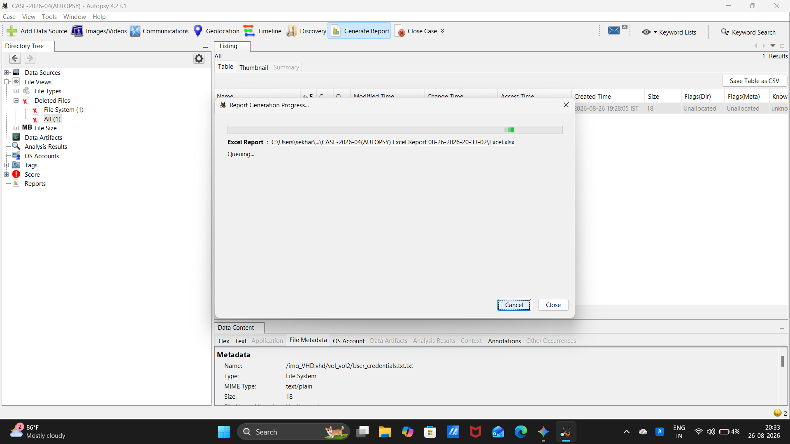
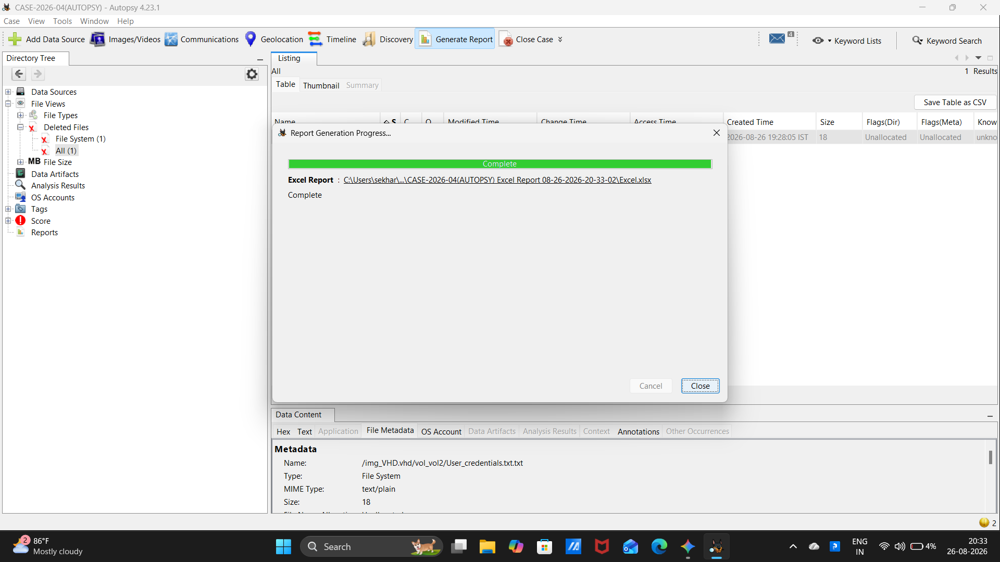

# 🧪 EXPERIMENT 05 — Ex. No 5 Use Autopsy to create a case and import evidence

---

## 🎯 Objective

To create a digital forensics case in Autopsy, ingest and analyze storage evidence data sources, examine deleted files and metadata structures, and generate a comprehensive forensic report.

---

## 🧰 Tools / Requirements

- **Forensic Platform**: Autopsy 4.23.1 (64-bit) / The Sleuth Kit (TSK) engine
- **Host Operating System**: Microsoft Windows 11
- **Evidence Source**: Virtual Hard Disk volume (`VHD.vhd` / `New Volume (D:) 2.0 GB`)

---

## 📋 Experiment Scenario

> Controlled laboratory evidence was used for this experiment.

A forensic investigation case was initiated in Autopsy to analyze a storage volume containing deleted artifacts. The examiner configured formal case information, ingested the data source, ran automated analysis modules, identified deleted credential remnants from unallocated space, inspected low-level Master File Table (MFT) records using Sleuth Kit `istat` integration, and generated an exportable forensic report.

---

## 🔐 Evidence / Input

- **Case Name**: `CASE-2026-04(AUTOPSY)`
- **Case Number**: `04`
- **Examiner Details**: `SEKHAR REDDY` (Phone: `9392746218`, Email: `sekharnandireddy338@gmail.com`)
- **Ingested Data Source**: `VHD.vhd_1 Host` / `New Volume (D:) 2.0 GB`
- **Target Deleted File**: `/img_VHD.vhd/vol_vol2/User_credentials.txt.txt` (Size: 18 bytes, Unallocated, MFT Entry 45, Sequence 2)
- **Target Report Format**: Excel Spreadsheet (`Excel.xlsx`)

---

## ⚙️ Procedure

### Step 1 — Configuring Case Information and Examiner Details

Autopsy 4.23.1 was launched and a new forensic case was initialized. In the **Optional Information** window, case details were configured:
- **Case Number**: `04`
- **Examiner Name**: `SEKHAR REDDY`
- **Examiner Phone**: `9392746218`
- **Examiner Email**: `sekharnandireddy338@gmail.com`

---

### Step 2 — Selecting and Adding Storage Data Source

The *Add Data Source* wizard was executed. Under the Local Disk option, the target evidence drive `New Volume (D:) 2.0 GB` was selected with timezone set to `(GMT+5:30) Asia/Calcutta`.

---

### Step 3 — Confirming Data Source Ingest into Local Database

The data source was committed and ingested into the SQLite case database, initiating automated ingest modules.

---

### Step 4 — Exploring Directory Tree and Data Source Hierarchy

The Autopsy Directory Tree was navigated to inspect the ingested data source hierarchy, confirming active indexing of `VHD.vhd_1 Host`.

---

### Step 5 — Analyzing Deleted Files and Text Artifacts

Under **File Views -> Deleted Files -> All (1)**, the deleted artifact `User_credentials.txt.txt` (18 bytes, Unallocated) was identified. The lower Data Content pane (Text view) revealed the recovered credential payload:
`admin:password@123`
`-------------------METADATA-------------------`

---

### Step 6 — Examining File Metadata and Sleuth Kit istat Output

The **File Metadata** tab was selected to analyze low-level filesystem attributes integrated from The Sleuth Kit `istat` tool:
- **File Name Allocation**: `Unallocated`
- **Metadata Allocation**: `Unallocated`
- **Modified / Accessed / Changed**: `2026-08-26 19:29:09 IST`
- **Created**: `2026-08-26 19:28:05 IST`
- **MFT Entry Header**: `Entry: 45 Sequence: 2`
- **Flags**: `Archive`

---

### Step 7 — Configuring Forensic Report Generation Module

The *Generate Report* tool was opened from the toolbar. The **Excel Report** module was selected to create a structured spreadsheet report of findings and tagged items.

---

### Step 8 — Selecting Target Data Source for Reporting

In the report configuration wizard, the ingested data source `VHD.vhd` was selected for inclusion.

---

### Step 9 — Executing Report Generation Pipeline

The report generation engine processed the case database and compiled artifact tables.

---

### Step 10 — Verifying Final Report Generation Completion

The report generation pipeline concluded with status `Complete`. The generated report path was confirmed:
`CASE-2026-04(AUTOPSY) Excel Report 08-26-2026-20-33-02\Excel.xlsx`

---

## 🔎 Observations

1. Autopsy successfully created case `CASE-2026-04(AUTOPSY)` with examiner metadata.
2. Ingestion of data source `VHD.vhd_1 Host` indexed volume partitions and file structures.
3. Deleted file view isolated unallocated record `User_credentials.txt.txt` (18 bytes).
4. Content viewer extracted string `admin:password@123`.
5. Sleuth Kit `istat` metadata verified MFT Entry 45, Sequence 2, and timestamp records.
6. Report generation generated `Excel.xlsx` in the case reports directory.

---

## 🧠 Findings

- **Artifact Carving and Recovery**: Autopsy parsed unallocated space on the NTFS volume to identify and preview deleted file contents without requiring full sector imaging.
- **Filesystem Metadata Auditing**: Integration with The Sleuth Kit provided low-level MFT inode and timestamp tracking essential for forensic reconstruction.
- **Reporting Soundness**: The automated report generation module compiled findings into a standardized audit format.

---

## 📊 Result

✅ Successfully completed

The forensic case was created in Autopsy, the disk image was ingested and analyzed, deleted credentials were recovered, and a comprehensive Excel report was generated.

---

## 📝 Conclusion

Autopsy effectively managed the forensic case lifecycle from data source ingestion and unallocated space analysis to MFT metadata inspection and automated report compilation.

---

## 📚 References

- Autopsy User Documentation (Basis Technology / Sleuth Kit)
- Laboratory Manual: `Ex.No.5 Autopsy.docx`
