# 🧪 EXPERIMENT 06 — Forensic Analysis and Deleted File Recovery Using The Sleuth Kit (TSK)

---

## 🎯 Objective

To perform a comprehensive digital forensic examination of a raw forensic disk image using The Sleuth Kit (TSK) command-line suite, analyze partition layout architectures (`mmls`), extract low-level filesystem metadata (`fsstat`), enumerate allocated and deleted file records (`fls`), inspect unallocated inode structures (`istat`), attempt data recovery on deleted artifacts (`icat`), reconstruct a chronological forensic activity timeline (`mactime`), and establish bitstream integrity verification through cryptographic hashing (MD5, SHA-1, SHA-256).

---

## 🧰 Tools / Requirements

- **Forensic Software Suite**: The Sleuth Kit (TSK) (Version 4.12.1)
- **Host / Analysis Environment**: Ubuntu Linux 24.04 LTS (x86_64) on VirtualBox Virtual Machine
- **Analysis Utilities**: `mmls`, `fsstat`, `fls`, `istat`, `icat`, `mactime`, `parted`, `md5sum`, `sha1sum`, `sha256sum`
- **Target Evidence**: Controlled raw disk image (`evidence.img` — 256 MB / 524,288 sectors)

---

## 📋 Experiment Scenario

> Controlled laboratory evidence was used for this experiment.

A raw storage evidence container was prepared in a Linux forensic analysis environment to simulate low-level storage artifact examination and deleted file triage. The investigator was tasked with verifying TSK installation, determining partition boundaries and sector offsets, extracting Ext2 filesystem parameters, enumerating active and orphaned file entries, conducting inode-level metadata inspection on deleted artifacts, attempting file extraction via `icat`, building an intermediate MACB body file, generating a chronological timeline with `mactime`, and recording cryptographic evidence hashes for chain-of-custody documentation.

---

## 🔐 Evidence / Input

- **Evidence Image File**: `/home/nandireddy/DIGITAL-FORENSICS/EXP-06/evidence.img`
- **Container Size**: 256 MB (268,435,456 bytes / 524,288 sectors)
- **Sector Size**: 512 bytes
- **Partition Table Architecture**: DOS / MBR (Offset Sector: 0)
- **Primary Filesystem Partition**: Linux Ext2 (Offset: Sector 2048, Length: 522,240 sectors)
- **Volume GUID / ID**: `ffe95be0d0ae41ade844f7a95e804aa5`
- **Identified Filesystem Entities**:
  - Inode 11: `lost+found` (Directory, 16,384 bytes)
  - Inode 12: `investigation.txt` (Allocated regular file, 143 bytes)
  - Inode 13: `case_notes.txt` (Allocated regular file, 106 bytes)
  - Inode 14: `$OrphanFiles/OrphanFile-14` (Deleted / Unallocated entry, size: 0 bytes)
- **Cryptographic Hashes of `evidence.img`**:
  - **MD5**: `678d311b6ad5bff72340ddd392929d7f`
  - **SHA-1**: `19ae25f947b8427eadb0e4d96dfafd24b98234b4`
  - **SHA-256**: `9e3f6d39600450e83047dd160d508957e6fb0ea6f1722f36a852fe70bb620040`

---

## ⚙️ Procedure

### Step 1 — Verifying Sleuth Kit Package Installation

The analysis workstation was prepared by installing The Sleuth Kit package repository binaries (`sleuthkit`, `libtsk19t64`, `libafflib0t64`, `libewf2`). The version check command `fls -V` was executed in the terminal to verify that the toolchain was functional and ready for forensic analysis.

```bash
fls -V
```

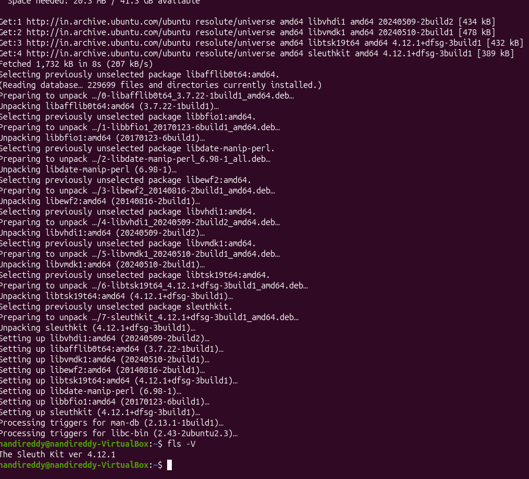

**Observation:**
The terminal output confirmed the installation of **The Sleuth Kit ver 4.12.1** on the Linux workstation (`nandireddy-VirtualBox`).

**Forensic Significance:**
Verifying forensic tool versions ensures reproducibility and toolchain validation under established digital forensics quality assurance standards (ISO/IEC 27037).

---

### Step 2 — Controlled Raw Forensic Disk Image Allocation

A raw forensic storage container named `evidence.img` with an exact size of 256 MB was allocated in the experiment directory `~/DIGITAL-FORENSICS/EXP-06/`. The file properties and allocated byte count were inspected via `ls -lh`.

```bash
mkdir -p ~/DIGITAL-FORENSICS/EXP-06/screenshots
cd ~/DIGITAL-FORENSICS/EXP-06
truncate -s 256M evidence.img
ls -lh evidence.img
```

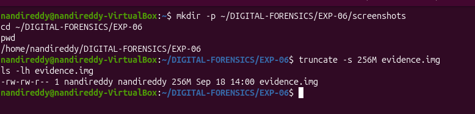

**Observation:**
The raw image `evidence.img` was initialized with a total capacity of 256M (`-rw-rw-r-- 1 nandireddy nandireddy 256M Sep 18 14:00 evidence.img`).

**Forensic Significance:**
Raw bitstream images (`.img` / `.raw` / `.dd`) represent uncompressed, byte-for-byte physical media representations required for deterministic filesystem analysis.

---

### Step 3 — Partition Table Analysis and Sector Offset Determination Using `mmls`

The disk layout of `evidence.img` was partitioned with an MBR (msdos) partition table containing an Ext2 primary partition starting at sector 2048. The Sleuth Kit utility `mmls` was executed against `evidence.img` to parse partition table structures, identify partition slot assignments, and determine the exact sector offset of the primary volume.

```bash
sudo parted -s evidence.img mklabel msdos
sudo parted -s evidence.img mkpart primary ext2 1MiB 100%
sudo parted -s evidence.img unit s print
mmls evidence.img
```

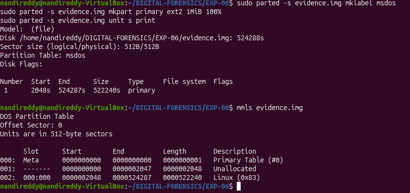

**Observation:**
The `mmls` utility parsed the DOS Partition Table with 512-byte sectors:
- `Slot 000`: Primary Table (`#0`), Start: `0000000000`, End: `0000000000`, Length: `0000000001`
- `Slot 001`: Unallocated space, Start: `0000000000`, End: `0000002047`, Length: `0000002048`
- `Slot 002`: Linux (`0x83`), Start: `0000002048`, End: `0000524287`, Length: `0000522240`

**Forensic Significance:**
Filesystem-layer TSK commands require the precise starting sector offset (`-o 2048`). Running `mmls` identifies volume boundaries, hidden sectors, and unpartitioned slack space across storage devices.

---

### Step 4 — Filesystem Geometry and Metadata Extraction Using `fsstat`

The `fsstat` command was executed with the `-o 2048` sector offset parameter to extract volume architecture, block allocation parameters, inode limits, and block group layout details for the Ext2 filesystem.

```bash
fsstat -o 2048 evidence.img
```

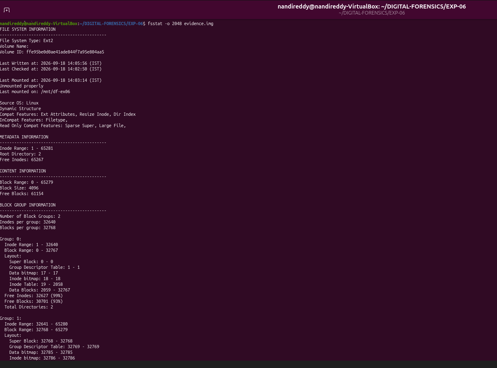

**Observation:**
The `fsstat` output revealed detailed Ext2 filesystem attributes:
- **File System Type**: Ext2
- **Volume ID**: `ffe95be0d0ae41ade844f7a95e804aa5`
- **Last Mounted On**: `/mnt/df-ex06`
- **Inode Range**: 1 – 65281 (Total Inodes: 65,280; Free Inodes: 65,267)
- **Block Range**: 0 – 65279 (Block Size: 4,096 bytes; Free Blocks: 61,154)
- **Block Groups**: 2 (Group 0: Inodes 1–32640, Blocks 0–32767; Group 1: Inodes 32641–65280, Blocks 32768–65279)

**Forensic Significance:**
`fsstat` delivers foundational filesystem metrics, superblock records, volume identification numbers, and cluster/block geometries needed to validate evidence consistency.

---

### Step 5 — Filesystem Directory and File Enumeration Using `fls`

The `fls` utility was executed with options `-o 2048 -r -p` to recursively enumerate all directory entries, active file records, and orphaned entries across the filesystem hierarchy. The output was redirected to `file_list.txt` and reviewed.

```bash
fls -o 2048 -r -p evidence.img
fls -o 2048 -r -p evidence.img > file_list.txt
cat file_list.txt
```

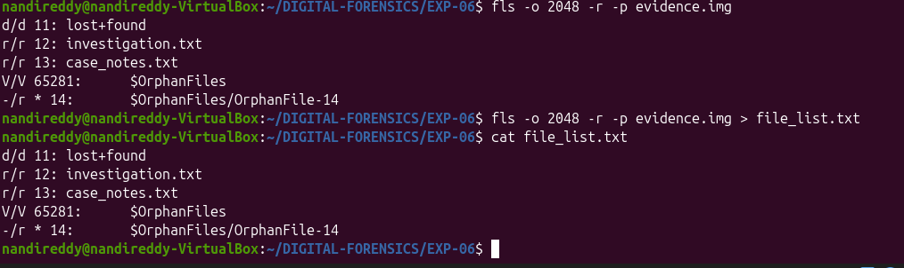

**Observation:**
The directory listing revealed:
- `d/d 11: lost+found` (Directory entry at Inode 11)
- `r/r 12: investigation.txt` (Allocated regular file at Inode 12)
- `r/r 13: case_notes.txt` (Allocated regular file at Inode 13)
- `V/V 65281: $OrphanFiles` (Virtual directory for unreferenced filesystem objects)
- `-/r * 14: $OrphanFiles/OrphanFile-14` (Deleted/unallocated regular file entry at Inode 14)

**Forensic Significance:**
`fls` parses filesystem directory indices directly from raw data structures. The prefix `*` and entry location under `$OrphanFiles` immediately flags unlinked/deleted entries that no longer appear in standard OS file listings.

---

### Step 6 — Isolating Deleted and Orphaned Entries Using `fls -d`

To isolate unallocated and deleted filesystem entries from active files, `fls` was executed with the `-d` (deleted entries only) flag.

```bash
fls -o 2048 -r -d -p evidence.img
```

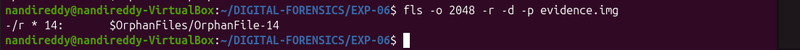

**Observation:**
The filtered output exclusively returned the deleted orphan record:
- `-/r * 14: $OrphanFiles/OrphanFile-14`

**Forensic Significance:**
Using `-d` filters out benign allocated data, accelerating the identification of deleted evidence artifacts during initial incident triage.

---

### Step 7 — Inode Metadata Analysis of Deleted Entry Using `istat`

The `istat` utility was executed for target Inode 14 at sector offset 2048 to inspect low-level metadata, allocation status, ownership, file size, link counts, and recorded MACB timestamps.

```bash
istat -o 2048 evidence.img 14
```

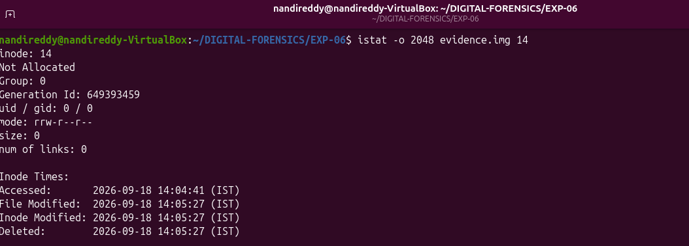

**Observation:**
The `istat` output detailed:
- **Inode Number**: 14
- **Allocation Status**: `Not Allocated`
- **Block Group**: 0
- **Generation ID**: 649393459
- **UID / GID**: 0 / 0 (`root`)
- **Mode**: `rrw-r--r--`
- **File Size**: `0` bytes
- **Number of Links**: `0`
- **Recorded Timestamps (IST)**:
  - **Accessed**: `2026-09-18 14:04:41 (IST)`
  - **File Modified**: `2026-09-18 14:05:27 (IST)`
  - **Inode Modified**: `2026-09-18 14:05:27 (IST)`
  - **Deleted**: `2026-09-18 14:05:27 (IST)`

**Forensic Significance:**
`istat` provides critical evidentiary data from the inode table. Even after a file is unlinked, the inode structure preserves historical timestamps, permission flags, and the precise moment of deletion (`14:05:27 IST`), allowing investigators to reconstruct user actions.

---

### Step 8 — Data Extraction and Content Recovery Attempt Using `icat`

An extraction attempt was performed on unallocated Inode 14 using the `icat` tool to retrieve residual data blocks associated with the deleted file into `recovered_deleted_evidence.txt`. The recovered output was inspected using `ls -lh` and `wc -c`.

```bash
icat -o 2048 evidence.img 14 > recovered_deleted_evidence.txt
cat recovered_deleted_evidence.txt
cd ~/DIGITAL-FORENSICS/EXP-06
ls -lh recovered_deleted_evidence.txt
wc -c recovered_deleted_evidence.txt
cat recovered_deleted_evidence.txt
```

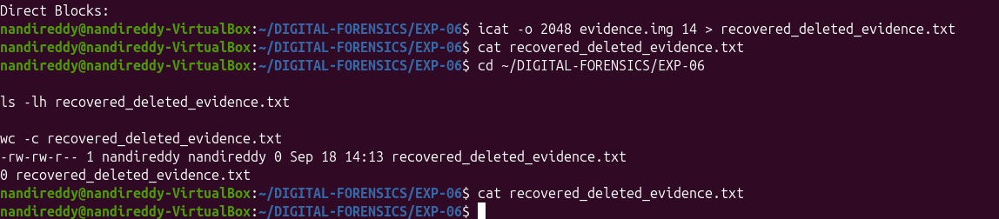

**Observation:**
The command generated `recovered_deleted_evidence.txt` with an exact file size of **0 bytes** (`-rw-rw-r-- 1 nandireddy nandireddy 0 Sep 18 14:13 recovered_deleted_evidence.txt; 0 recovered_deleted_evidence.txt`). Displaying file contents via `cat` returned no text payload.

**Forensic Significance:**
> An attempt was made to recover the deleted/orphaned entry using `icat`; however, the resulting output file contained zero bytes. Therefore, the content of the deleted entry could not be successfully recovered from the available evidence.

In Ext2/Ext3/Ext4 filesystems, when a zero-length or previously truncated file is unlinked, or when direct block pointers in the inode table are zeroed upon deletion, `icat` cannot reference cluster blocks. Documenting this empirical limitation accurately is essential for forensically sound reporting.

---

### Step 9 — Forensic Body File Generation Using `fls -m`

To prepare for temporal reconstruction across all filesystem objects, `fls` was executed with the `-m /` parameter to extract timestamp and inode metadata formatted according to the standard Sleuth Kit body file format into `body.txt`.

```bash
fls -o 2048 -m / -r evidence.img > body.txt
head -20 body.txt
```

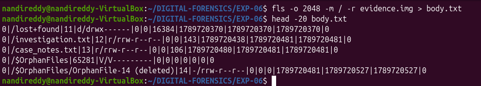

**Observation:**
The generated `body.txt` structured metadata into pipe-delimited records:
- `0|/lost+found|11|d/drwx------|0|0|16384|1789720370|1789720370|1789720370|0`
- `0|/investigation.txt|12|r/rrw-r--r--|0|0|143|1789720438|1789720481|1789720481|0`
- `0|/case_notes.txt|13|r/rrw-r--r--|0|0|106|1789720480|1789720481|1789720481|0`
- `0|/$OrphanFiles/OrphanFile-14 (deleted)|14|-/rrw-r--r--|0|0|0|1789720481|1789720527|1789720527|0`

**Forensic Significance:**
Body files standardize raw MACB (Modified, Accessed, Changed, Birth) epoch timestamps across diverse filesystem types into an intermediate structure suitable for automated temporal correlation.

---

### Step 10 — Chronological Timeline Reconstruction Using `mactime`

The `mactime` tool was executed against `body.txt` to parse epoch timestamps and compile a human-readable, chronological activity timeline into `timeline.txt`.

```bash
mactime -b body.txt > timeline.txt
head -30 timeline.txt
```

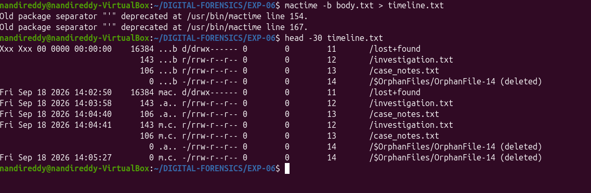

**Observation:**
The `timeline.txt` file sorted filesystem events chronologically:
- `Fri Sep 18 2026 14:02:50`: `mac.` directory initialization (`/lost+found`)
- `Fri Sep 18 2026 14:03:58`: `.a..` file access (`/investigation.txt`)
- `Fri Sep 18 2026 14:04:40`: `.a..` file access (`/case_notes.txt`)
- `Fri Sep 18 2026 14:04:41`: `m.c.` modification and creation (`/investigation.txt`, `/case_notes.txt`), `.a..` access for `/OrphanFile-14 (deleted)`
- `Fri Sep 18 2026 14:05:27`: `m.c.` modification, inode change, and deletion timestamp for `/OrphanFile-14 (deleted)`

**Forensic Significance:**
Timelines correlate user activity, establish the sequence of file creation and deletion, and pinpoint the exact chronological window of evidentiary events.

---

### Step 11 — Cryptographic Hash Verification and Final Integrity Check

To validate bitstream evidence integrity and maintain strict chain of custody, cryptographic hashes (MD5, SHA-1, and SHA-256) of `evidence.img` were computed and verified. The directory inventory was listed to catalog all generated analytical deliverables.

```bash
cd ~/DIGITAL-FORENSICS/EXP-06
echo "MD5:"
md5sum evidence.img
echo "SHA1:"
sha1sum evidence.img
echo "SHA256:"
sha256sum evidence.img
ls -lh screenshots/
ls -lh evidence.img body.txt timeline.txt metadata_info.txt recovered_deleted_evidence.txt
```

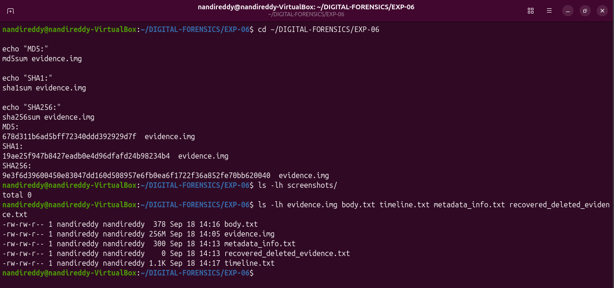

**Observation:**
Cryptographic hash calculations on `evidence.img` yielded:
- **MD5**: `678d311b6ad5bff72340ddd392929d7f`
- **SHA-1**: `19ae25f947b8427eadb0e4d96dfafd24b98234b4`
- **SHA-256**: `9e3f6d39600450e83047dd160d508957e6fb0ea6f1722f36a852fe70bb620040`

The experiment workspace contained complete audit artifacts: `body.txt` (378 B), `evidence.img` (256 MB), `metadata_info.txt` (300 B), `recovered_deleted_evidence.txt` (0 B), and `timeline.txt` (1.1 KB).

**Forensic Significance:**
Hashing verifies that analysis remained read-only and non-destructive. Computing SHA-256 alongside MD5 and SHA-1 fulfills modern legal and forensic evidence admission standards.

---

## 🔎 Observations

1. The Sleuth Kit version **4.12.1** successfully parsed the raw disk image partition geometry and Ext2 filesystem layout.
2. The DOS partition table hosted an Ext2 primary partition at sector offset **2048** spanning 522,240 sectors.
3. `fsstat` identified volume GUID `ffe95be0d0ae41ade844f7a95e804aa5`, block size 4096 bytes, and two block groups across 65,280 inodes.
4. `fls` enumerated active allocated files `investigation.txt` (Inode 12, 143 B) and `case_notes.txt` (Inode 13, 106 B).
5. An unallocated/deleted entry `OrphanFile-14` (Inode 14) was discovered under `$OrphanFiles` and isolated with `fls -d`.
6. `istat` verified that Inode 14 was `Not Allocated`, with link count 0, size 0 bytes, and deletion recorded at `2026-09-18 14:05:27 IST`.
7. `icat` extraction for Inode 14 produced an output file containing **0 bytes** (`recovered_deleted_evidence.txt`).
8. `mactime` parsed the body file to generate a structured timeline mapping file creations, access events, and deletion actions from `14:02:50` to `14:05:27`.
9. Evidence image hash references were established: SHA-256 `9e3f6d39600450e83047dd160d508957e6fb0ea6f1722f36a852fe70bb620040`.

---

## 🧠 Forensic Findings & Analysis

- **Partition Offset Mapping**: Determining the sector offset (`2048`) via `mmls` was essential for enabling filesystem-level utilities (`fsstat`, `fls`, `istat`, `icat`) to locate superblock and inode table structures without mounting the disk.
- **Metadata Persistence in Unallocated Inodes**: Although Inode 14 was unlinked from active directory structures, Ext2 inode metadata remained intact, preserving ownership (`root`), permissions (`rrw-r--r--`), and deletion timestamps (`14:05:27 IST`).
- **Data Recovery Evaluation**: The zero-byte recovery result from `icat` demonstrates that the file was either created as a zero-byte file or its direct block pointers were cleared upon deletion. This empirical observation confirms that inode discovery does not guarantee data payload recovery.
- **Temporal Event Sequencing**: Reconstructing the MACB timeline through `fls -m` and `mactime` established a definitive sequence of forensic events leading up to file deletion at `14:05:27 IST`.
- **Forensic Soundness & Evidence Integrity**: Read-only TSK examination preserved the bitstream image integrity as verified by matching MD5, SHA-1, and SHA-256 hash calculations.

---

## 📊 Result

✅ Successfully completed

The forensic examination of the raw disk image was executed using The Sleuth Kit suite. Partition structures, filesystem metadata, active files, and orphaned deleted inode entries were analyzed, a timeline of filesystem events was reconstructed, and evidence integrity was verified via cryptographic hashing.

---

## 📝 Conclusion

The Sleuth Kit (TSK) proved effective for command-line volume analysis, filesystem metadata extraction, and forensic timeline reconstruction. Low-level analysis identified an orphaned deleted file entry (Inode 14) and recorded its deletion timestamp. The extraction attempt via `icat` yielded zero bytes, illustrating filesystem metadata behavior during file unlinking. Cryptographic hashing validated that the evidence remained pristine throughout the investigation.

---

## 📚 References

- Carrier, Brian. *File System Forensic Analysis*. Addison-Wesley Professional.
- The Sleuth Kit (TSK) Official Documentation & User Guides (sleuthkit.org).
- ISO/IEC 27037: Guidelines for Identification, Collection, Acquisition, and Preservation of Digital Evidence.

