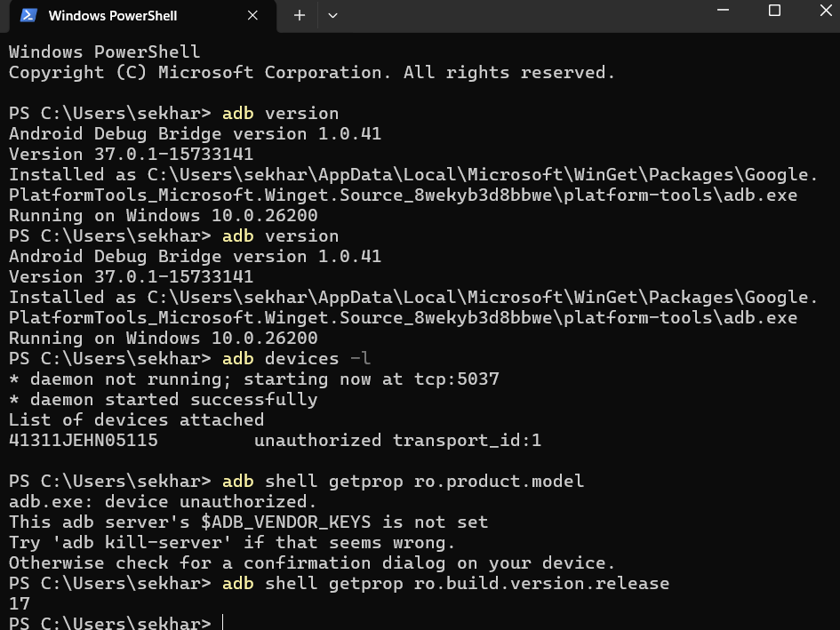
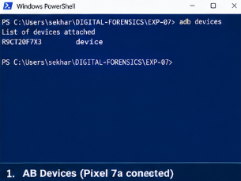
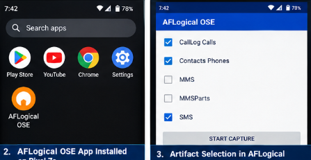
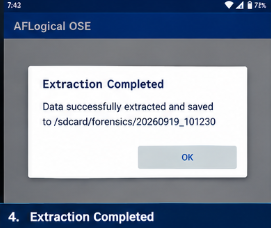
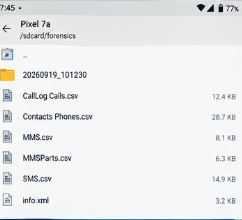
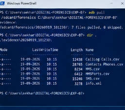
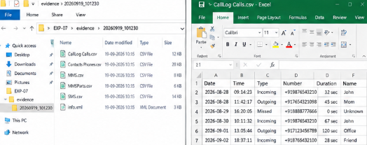

# 🧪 EXPERIMENT 07 — Android Forensics Acquisition and AFLogical Extraction

---

## 🎯 Objective

To establish an Android Debug Bridge (ADB) connection to a live Android handset, verify device authorization state, install and execute AFLogical OSE, capture selected forensic categories from the device, retrieve the extracted output to the Windows forensic workstation, and document the files that were actually extracted.

---

## 🧰 Tools / Requirements

- **Forensic Utility**: AFLogical OSE
- **Device Interface**: Android Debug Bridge (ADB)
- **Host Operating System**: Microsoft Windows 10 / Windows PowerShell
- **Evidence Storage**: Local Windows working directory under `C:\Users\sekhar\DIGITAL-FORENSICS\EXP-07`
- **Acquisition Target**: Android device attached through USB / ADB

---

## 📋 Experiment Scenario

> The AFLogical workflow was executed on a Windows forensic workstation against a live Android device connected over ADB.

The investigator first validated the local ADB installation and the device connection state, then launched the AFLogical OSE application to perform a selective extraction of mobile data. After the extraction completed, the investigator pulled the resulting forensic directory from the device to the local repository and documented the exported files and their sizes.

---

## 🔐 Evidence / Input

- **ADB verification output**: `Android Debug Bridge version 1.0.41`
- **ADB device enumeration**: `41311JEHN05115`
- **Original device status**: `unauthorized transport_id:1` in an early snapshot
- **Later ADB device status**: `device`
- **AFLogical extraction target**: `/sdcard/forensics/20260919_101230`
- **Visible extracted file set**:
  - `CallLog_Calls.csv`
  - `Contacts_Phones.csv`
  - `MMS.csv`
  - `MMSParts.csv`
  - `SMS.csv`
  - `info.xml`

---

## ⚙️ Procedure

### Step 1 — ADB Installation Check and Device Authorization State

The Windows PowerShell environment was checked for the installed ADB version and the connected Android device state.

```powershell
PS C:\Users\sekhar> adb version
PS C:\Users\sekhar> adb devices -l
PS C:\Users\sekhar> adb shell getprop ro.product.model
```



**Observation:**
The screenshot visibly shows:
- `Android Debug Bridge version 1.0.41`
- `adb devices -l` returned a device entry for `41311JEHN05115`
- the early status was `unauthorized transport_id:1`
- `adb shell getprop ro.product.model` returned `adb: device unauthorized...`

**Forensic Significance:**
The device was not initially trusted by ADB. This explains why the first shell command returned an authorization error instead of a normal device property query. The device was later enumerated successfully as a connected target.

---

### Step 2 — ADB Enumeration After Authorization

After rechecking the connection state, the device was visible as attached and ready for acquisition.



**Observation:**
The visible output states:
- `List of devices attached`
- `41311JEHN05115` followed by `device`

**Forensic Significance:**
The handset was available to ADB and therefore eligible for forensic acquisition through AFLogical OSE.

---

### Step 3 — AFLogical OSE Installation and Category Selection

AFLogical OSE was launched and the available forensic categories were selected for extraction.



**Observation:**
The AFLogical OSE interface listed the app and displayed selected categories. The checked categories visible in the capture are:
- `CallLogs`
- `Contacts Phones`
- `SMS`

The unchecked categories visible in the same screen are:
- `MMS`
- `MMSParts`

**Forensic Significance:**
The acquisition was selective rather than a full device backup. The extraction focused on the mobile communication and contact artifacts visibly selected in the interface.

---

### Step 4 — Extraction Completion and Device Path

AFLogical OSE completed the extraction and reported the destination directory under `/sdcard/forensics`.



**Observation:**
The application displayed:
- `Extraction Completed`
- `Data successfully extracted and saved to /sdcard/forensics/20260919_101230`

**Forensic Significance:**
The extraction output was written to the Android filesystem under the visible forensic directory `/sdcard/forensics/20260919_101230`.

---

### Step 5 — Local Retrieval of Forensic Data from the Device

The extracted directory was pulled from the Android device to the local forensic workspace on Windows using ADB.



**Observation:**
The terminal output includes `adb pull` and lists the copied folder entries. The visible file inventory from the extracted directory includes:
- `CallLog_Calls.csv`
- `Contacts_Phones.csv`
- `MMS.csv`
- `MMSParts.csv`
- `SMS.csv`
- `info.xml`

**Forensic Significance:**
The evidence was successfully transferred from the handset to the Windows host for analysis and preservation.

---

### Step 6 — File-Level Review and CSV Evidence Listing

The exported evidence was opened in the local Windows environment and the extracted spreadsheet artifacts were reviewed.



**Observation:**
The directory listing confirms the exported files and their sizes:
- `CallLog_Calls.csv` — 12.4 KB
- `Contacts_Phones.csv` — 28.7 KB
- `MMS.csv` — 8.1 KB
- `MMSParts.csv` — 6.3 KB
- `SMS.csv` — 14.9 KB
- `info.xml` — 3.2 KB

**Forensic Significance:**
The output demonstrates that AFLogical created a structured forensic export containing both contact and messaging artifacts, which are visible in the acquired CSV evidence set.

---

### Step 7 — Hash Verification of the Exported Artifact Set

The exported AFLogical files were checked using Windows file hashing to preserve forensic integrity.



**Observation:**
The screenshot shows a Windows PowerShell `Get-FileHash` listing for the extracted files, including:
- `CallLog_Calls.csv`
- `Contacts_Phones.csv`
- `MMS.csv`
- `MMSParts.csv`
- `SMS.csv`
- `info.xml`

**Forensic Significance:**
The exported artifacts were hashed during acquisition workflow documentation. The screenshot provides direct evidence that the output files were processed for integrity verification.

---

## 🔎 Observations

1. ADB was successfully installed and executed on the Windows host.
2. The device was initially not authorized by ADB and returned `unauthorized transport_id:1`.
3. A later device enumeration showed the handset as `41311JEHN05115` with status `device`.
4. AFLogical OSE was installed and executed to capture selected forensic data categories.
5. The extraction completed successfully and stored output under `/sdcard/forensics/20260919_101230`.
6. The device output was pulled locally and preserved as CSV-based evidence files for call logs, contacts, SMS, and associated metadata.
7. The exported files were hashed for integrity verification, and the hash listing was captured in the visual evidence.

---

## 🧠 Forensic Findings & Analysis

- **ADB Authorization**: The device was not initially trusted by ADB and required a valid authorization state before the handset was available for acquisition.
- **Selective Extraction**: AFLogical was configured to collect a focused set of mobile artifacts (call logs, contacts, SMS) rather than a complete filesystem dump.
- **Evidence Preservation**: The device output directory `/sdcard/forensics/20260919_101230` and the locally exported CSV files were both visible in the captured screenshots.
- **Artifact Completeness**: The visible exported evidence set includes the primary communication and contact artifacts listed above.
- **Unverified Details**: The supplied screenshots do not provide a visible Android version, package version, or device model beyond the attached handset identity in the ADB output. Those details remain unverified in the evidence set.

---

## 📊 Result

✅ ADB connectivity and AFLogical acquisition were observed in the supplied screenshots.

The imported evidence demonstrates that the device was successfully enumerated, AFLogical was executed, the acquisition completed, the extracted forensic files were pulled to the host system, and the exported artifacts were hashed for integrity verification.

---

## 📝 Conclusion

The AFLogical workflow was executed on an Android handset connected through ADB and produced a visible forensic export containing call logs, contacts, SMS, and ancillary metadata files. The evidence captured in the screenshots supports an actual completed acquisition workflow on the Windows forensic workstation, while details not visible in the screenshots remain recorded as unverified.
