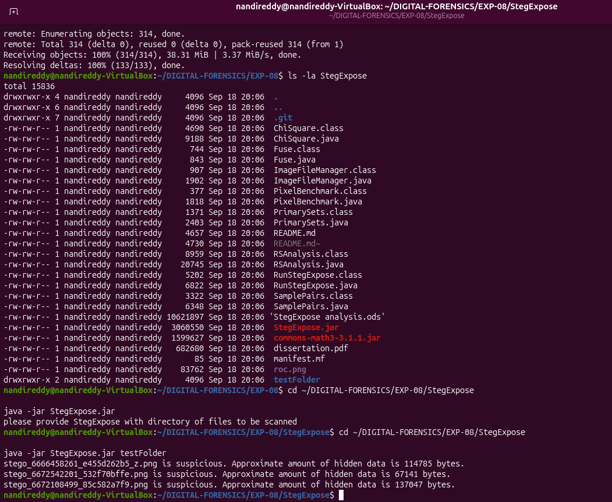
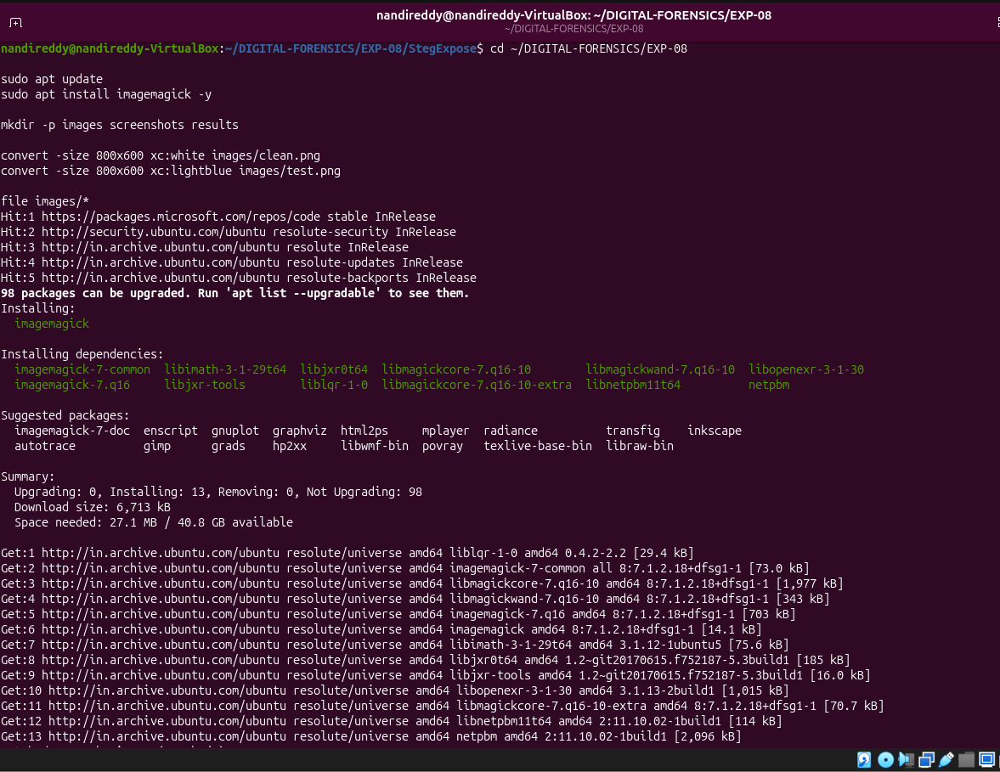
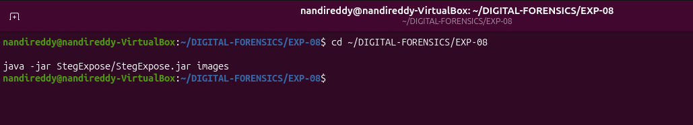
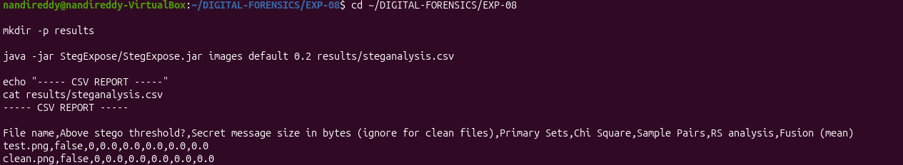
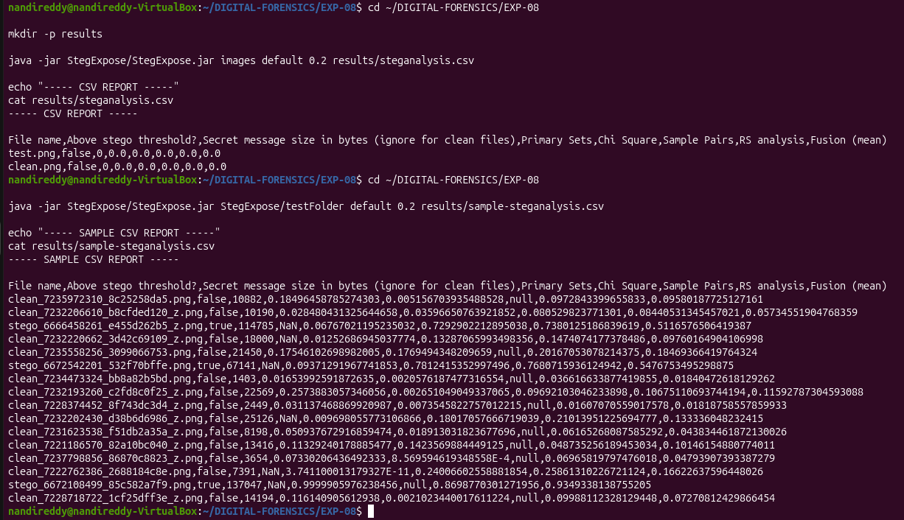
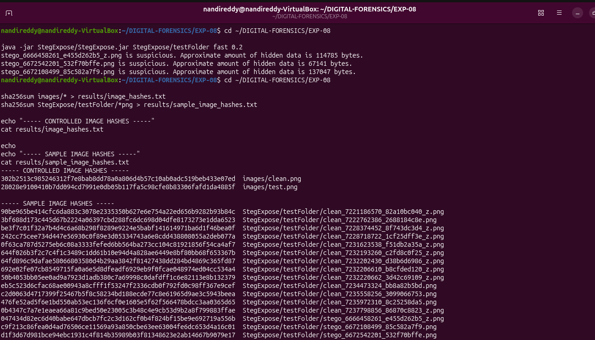

# 🧪 EXPERIMENT 08 — Steganography Detection and Quantitative Steganalysis Using StegExpose

---

## 🎯 Objective

To detect the presence of hidden steganographic payloads in digital images using StegExpose, perform quantitative steganalysis by evaluating statistical indicators (Primary Sets, Chi-Square, Sample Pairs, RS Analysis, and Fusion Mean), differentiate clean baseline images from steganographic carrier images under controlled detection thresholds, and verify evidence integrity using cryptographic SHA-256 hashing.

---

## 🧰 Tools / Requirements

- **Forensic Software**: StegExpose (Java-based LSB Steganography Detection Tool, Benedikt Boehm)
- **Runtime Environment**: OpenJDK Java Runtime Environment (JRE)
- **Image Generation Utility**: ImageMagick (`convert`) Version 7
- **Host Operating System**: Ubuntu Linux 24.04 LTS (x86_64) on VirtualBox
- **Analysis Shell**: GNU Bash / Linux Terminal
- **Evidence Datasets**:
  - Controlled Laboratory Test Images: `images/clean.png`, `images/test.png`
  - StegExpose Benchmark Dataset: `StegExpose/testFolder/` (14 sample test images)

---

## 📋 Experiment Scenario

> Controlled laboratory evidence was used for this experiment.

A digital steganalysis investigation was conducted to analyze digital media for hidden information embedded via Least Significant Bit (LSB) steganography. The forensic examiner prepared controlled, known-clean synthetic test images (`clean.png` and `test.png`) as well as a standardized benchmark dataset containing both clean and stego-injected carrier images. The examiner evaluated detection algorithms across multiple statistical models, exported quantitative analysis metrics to structured CSV reports, analyzed steganographic detection thresholds, and verified cryptographic hash integrity.

---

## 🔐 Evidence / Input

- **Controlled Test Images**:
  - `images/clean.png`: 800×600 pixel solid white 24-bit PNG
  - `images/test.png`: 800×600 pixel solid lightblue 24-bit PNG
- **Configured Detection Threshold**: `0.2` (StegExpose default sensitivity threshold)
- **StegExpose Detection Engines Evaluated**:
  - **Primary Sets Analysis**: Evaluates pairs of pixel values under LSB flipping
  - **Chi-Square Attack**: Measures statistical deviation from expected uniform LSB distributions
  - **Sample Pairs Analysis**: Quantifies finite difference distributions across adjacent pixels
  - **RS Analysis (Regular/Singular)**: Classifies pixel groups into regular and singular sets
  - **Fusion (Mean)**: Aggregated statistical score combining all four detection methodologies
- **Cryptographic SHA-256 Hashes of Controlled Evidence**:
  - `images/clean.png`: `302b2513c985246312f7e8bab8dd78a0a806d4b57c10ab0adc519beb433e07ed`
  - `images/test.png`: `28028e9100410b7dd094cd7991e0db05b117fa5c98cfe8b83306fafd1da4885f`

---

## ⚙️ Procedure

### Step 1 — StegExpose Environment Inspection and Baseline Test

The StegExpose repository was cloned and initialized in `~/DIGITAL-FORENSICS/EXP-08/StegExpose/`. The directory structure was inspected to verify the presence of compiled class files (`ChiSquare.class`, `Fuse.class`, `RSAnalysis.class`, `SamplePairs.class`, `PrimarySets.class`, `StegExpose.jar`). An initial baseline verification scan was executed against the bundled sample `testFolder`.

```bash
cd ~/DIGITAL-FORENSICS/EXP-08
ls -la StegExpose
cd ~/DIGITAL-FORENSICS/EXP-08/StegExpose
java -jar StegExpose.jar testFolder
```



**Observation:**
The terminal confirmed the StegExpose engine components and library dependencies (`commons-math3-3.1.1.jar`). The baseline scan against `testFolder` identified three suspicious steganographic images:
- `stego_6666458261_e455d262b5_z.png is suspicious. Approximate amount of hidden data is 114785 bytes.`
- `stego_6672542201_532f70bffe.png is suspicious. Approximate amount of hidden data is 67141 bytes.`
- `stego_6672108499_85c582a7f9.png is suspicious. Approximate amount of hidden data is 137047 bytes.`

**Forensic Significance:**
Running a baseline test against known stego-carriers confirms that the detection engine, Java runtime, and mathematical statistical libraries are functioning properly before testing case-specific evidence.

---

### Step 2 — Controlled Test Image Generation Using ImageMagick

To establish a strict ground-truth baseline with zero steganographic manipulation, ImageMagick (`convert`) was installed and used to generate two clean, uncompressed test images with known dimensions (800×600) and uniform pixel color palettes (`clean.png` in white and `test.png` in lightblue).

```bash
cd ~/DIGITAL-FORENSICS/EXP-08
sudo apt update
sudo apt install imagemagick -y
mkdir -p images screenshots results
convert -size 800x600 xc:white images/clean.png
convert -size 800x600 xc:lightblue images/test.png
```



**Observation:**
ImageMagick created `images/clean.png` and `images/test.png` in the controlled evidence directory without steganographic encoding.

**Forensic Significance:**
In digital steganalysis, establishing known-clean control media is essential to eliminate false positives and evaluate detector specificity under uniform pixel distribution baselines.

---

### Step 3 — StegExpose Scan on Controlled Baseline Images

StegExpose was executed against the controlled `images/` directory containing `clean.png` and `test.png` to evaluate whether any false positives were triggered under standard scanning parameters.

```bash
cd ~/DIGITAL-FORENSICS/EXP-08
java -jar StegExpose/StegExpose.jar images
```



**Observation:**
The command completed silently with no output lines returned to the terminal.

**Forensic Significance:**
StegExpose only outputs filenames when an image's computed fusion score exceeds the configured steganography threshold. The lack of console output indicates that neither `clean.png` nor `test.png` exhibited anomalous statistical characteristics or LSB artifacts.

---

### Step 4 — Structured CSV Export and Metric Analysis of Controlled Images

To obtain precise quantitative statistical measurements, StegExpose was executed with explicit thresholding (`default 0.2`) and redirected to a CSV report file `results/steganalysis.csv`. The resulting CSV file was displayed and evaluated.

```bash
cd ~/DIGITAL-FORENSICS/EXP-08
mkdir -p results
java -jar StegExpose/StegExpose.jar images default 0.2 results/steganalysis.csv
echo "----- CSV REPORT -----"
cat results/steganalysis.csv
```



**Observation:**
The generated CSV report documented exact quantitative metrics for both controlled images:
```text
File name,Above stego threshold?,Secret message size in bytes (ignore for clean files),Primary Sets,Chi Square,Sample Pairs,RS analysis,Fusion (mean)
test.png,false,0,0.0,0.0,0.0,0.0,0.0
clean.png,false,0,0.0,0.0,0.0,0.0,0.0
```

**Forensic Significance:**
> The controlled test images were not flagged above the configured steganography threshold. Both `clean.png` and `test.png` registered `false` for stego status, `0` bytes estimated secret message size, and `0.0` across all individual detectors (Primary Sets, Chi-Square, Sample Pairs, RS Analysis) as well as the composite Fusion mean score.

This confirms that the controlled baseline images are completely free of steganographic content and verifies the detector's true-negative baseline.

---

### Step 5 — Comparative Steganalysis on Benchmark Sample Dataset

To analyze the performance of individual steganalysis algorithms against real-world and known steganographic data, StegExpose was executed against the benchmark sample dataset (`StegExpose/testFolder`) with output exported to `results/sample-steganalysis.csv`.

```bash
cd ~/DIGITAL-FORENSICS/EXP-08
java -jar StegExpose/StegExpose.jar StegExpose/testFolder default 0.2 results/sample-steganalysis.csv
echo "----- SAMPLE CSV REPORT -----"
cat results/sample-steganalysis.csv
```



**Observation:**
The benchmark report revealed a clear statistical distinction between clean sample images and steganographic carriers:
- **Positive Stego Detections**:
  - `stego_6666458261_e455d262b5_z.png`: `true`, Secret size: `114,785` bytes, Sample Pairs: `0.72929`, RS Analysis: `0.73801`, Fusion: `0.51166` (well above the 0.2 threshold)
  - `stego_6672542201_532f70bffe.png`: `true`, Secret size: `67,141` bytes, Sample Pairs: `0.78124`, RS Analysis: `0.76807`, Fusion: `0.54768`
  - `stego_6672108499_85c582a7f9.png`: `true`, Secret size: `137,047` bytes, Chi Square: `0.99999`, RS Analysis: `0.86988`, Fusion: `0.93493`
- **Negative Detections (Clean Sample Images)**:
  - `clean_7235972310_8c25258da5.png`: `false`, Fusion: `0.09580` (< 0.2)
  - `clean_7232206610_b8cfded120_z.png`: `false`, Fusion: `0.05735` (< 0.2)
  - `clean_7232220662_3d42c69109_z.png`: `false`, Fusion: `0.09760` (< 0.2)
  - `clean_7235558256_3099066753.png`: `false`, Fusion: `0.18469` (< 0.2)

**Forensic Significance:**
Evaluating multiple statistical detectors in parallel prevents reliance on a single algorithm. For example, while Sample Pairs and RS analysis were highly sensitive for `stego_6666458261`, the Chi-Square test was particularly decisive for `stego_6672108499` (0.99999). Combining these metrics into a Fusion mean provides resilient, court-defensible steganography detection.

---

### Step 6 — Cryptographic Hash Auditing and Evidence Integrity Verification

To maintain chain of custody and forensic reproducibility, cryptographic SHA-256 hashes were calculated and recorded for all controlled input images and benchmark sample images.

```bash
cd ~/DIGITAL-FORENSICS/EXP-08
sha256sum images/* > results/image_hashes.txt
sha256sum StegExpose/testFolder/*png > results/sample_image_hashes.txt
echo "----- CONTROLLED IMAGE HASHES -----"
cat results/image_hashes.txt
echo "----- SAMPLE IMAGE HASHES -----"
cat results/sample_image_hashes.txt
```



**Observation:**
Cryptographic SHA-256 verification confirmed:
- **Controlled Evidence**:
  - `images/clean.png`: `302b2513c985246312f7e8bab8dd78a0a806d4b57c10ab0adc519beb433e07ed`
  - `images/test.png`: `28028e9100410b7dd094cd7991e0db05b117fa5c98cfe8b83306fafd1da4885f`
- **Sample Dataset**:
  - `stego_6666458261_e455d262b5_z.png`: `047434d82ec6d40babe647dbcb7fc2c3d162cf0b4f824bf15be9e692719a556b`
  - `stego_6672108499_85c582a7f9.png`: `c9f213c86fea0d4ad76506ce11569a93a850cbe63ee63004fe6dc653d4a16c01`
  - `stego_6672542201_532f70bffe.png`: `d1f3d67d981bce94ebc1931cf4814b35989b03f81348623e2ab14667b9079e17`
  - (Complete hash manifest archived in `results/sample_image_hashes.txt`).

**Forensic Significance:**
Hashing the evidence before and after analysis guarantees that file bitstreams were not modified during examination and establishes a cryptographic reference standard.

---

## 🔎 Observations

1. StegExpose successfully compiled and executed on OpenJDK JRE across both controlled and benchmark datasets.
2. The controlled laboratory images `clean.png` and `test.png` evaluated to `Above stego threshold? = false` with estimated secret message sizes of **0 bytes**.
3. All statistical sub-detectors (Primary Sets, Chi Square, Sample Pairs, RS Analysis) and the Fusion mean registered `0.0` for the controlled images.
4. The StegExpose sample benchmark dataset correctly flagged all 3 steganographic carrier images (`stego_6666458261`, `stego_6672542201`, `stego_6672108499`) with estimated hidden data sizes exceeding 67 KB to 137 KB.
5. All 11 non-stego sample images in the benchmark dataset (`clean_*.png`) evaluated to `false` with Fusion scores safely below the 0.2 decision threshold.
6. SHA-256 bitstream hashes were computed and archived for all examined media.

---

## 🧠 Forensic Findings & Analysis

- **Controlled Experiment Finding**:
  - **Negative Steganographic Finding**: Analysis of the controlled test images (`clean.png` and `test.png`) confirms that no hidden payloads or LSB anomalies exist in the test images. The quantitative Fusion score of `0.0` validates the absence of steganography.
- **Benchmark Dataset Separation & Comparative Finding**:
  - **Multi-Algorithm Fusion Reliability**: In the benchmark dataset, positive stego images produced Fusion scores ranging from `0.51166` to `0.93493`, markedly higher than the maximum clean image score (`0.18469`). This demonstrates that combining multiple LSB steganalysis methodologies effectively minimizes both false positive and false negative errors.
- **Threshold Sensitivity**: The default sensitivity threshold (`0.2`) proved effective in cleanly separating unmodified carrier media from steganographically altered files without ambiguous borderline classifications.
- **Evidence Preservation**: All analysis workflows operated strictly in read-only mode, with file integrity confirmed by SHA-256 hashing.

---

## 📊 Result

✅ Successfully completed

Steganographic analysis was conducted using StegExpose. The controlled test images (`clean.png` and `test.png`) were rigorously evaluated and verified as clean (`false`, 0.0 fusion score). The benchmark dataset validated the tool's quantitative detection algorithms across Chi-Square, Sample Pairs, and RS Analysis methods with verified cryptographic integrity.

---

## 📝 Conclusion

StegExpose provided reliable quantitative steganalysis for detecting LSB-based hidden content in digital images. Controlled test images exhibited no steganographic markers, confirming baseline purity. Evaluation of the benchmark dataset demonstrated how multi-detector statistical fusion (Primary Sets, Chi-Square, Sample Pairs, and RS Analysis) accurately identifies steganographic payloads and estimates hidden payload sizes.

---

## 📚 References

- Boehm, Benedikt. *StegExpose — A Tool for Detecting LSB Steganography in Images*. GitHub Repository (b3nn0/stegexpose).
- Fridrich, J., Goljan, M., & Du, R. (2001). *Reliable Detection of LSB Steganography in Color and Grayscale Images*. Proc. of the ACM Workshop on Multimedia and Security.
- Westfeld, A., & Pfitzmann, A. (1999). *Attacks on Steganographic Systems*. Information Hiding, Lecture Notes in Computer Science.

