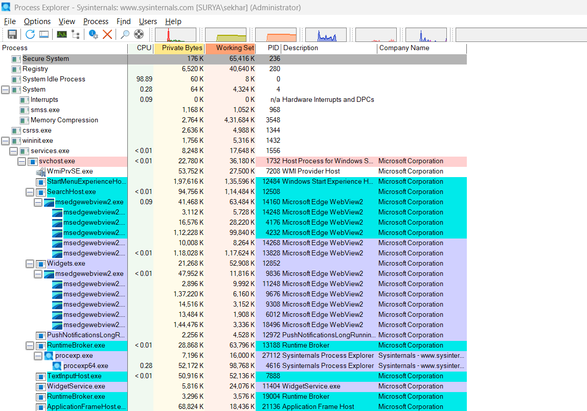
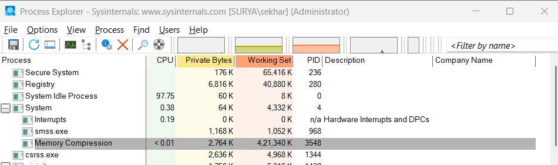
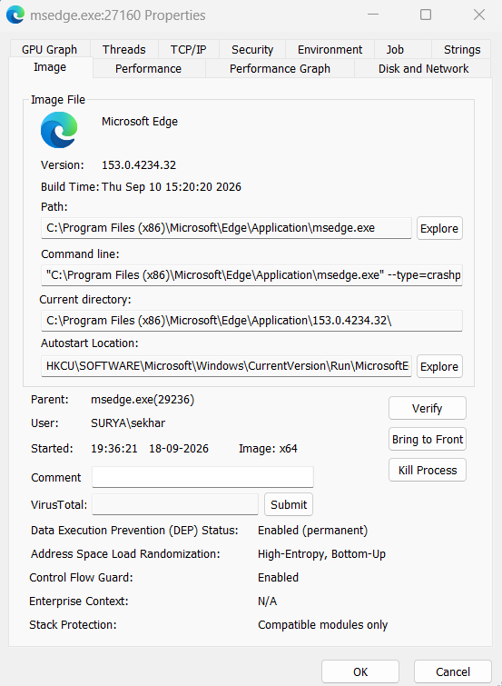
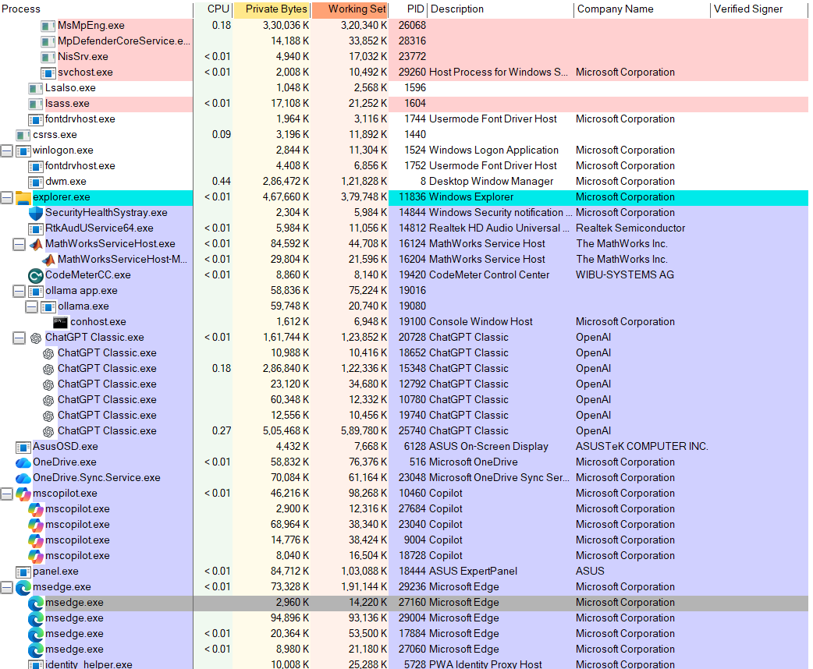
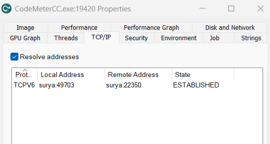

# 🧪 EXPERIMENT 09 — Live Process Analysis and Memory Inspection Using Microsoft Sysinternals Process Explorer

---

## 🎯 Objective

To perform live volatile system triage and process inspection using Microsoft Sysinternals Process Explorer, analyze process tree hierarchies (parent-child relationships), evaluate runtime execution metadata (PIDs, CPU/memory resource allocations), inspect binary image paths, command-line arguments, and autostart persistence locations, verify code signing and digital signature authenticity, and audit active network socket connections across live processes.

---

## 🧰 Tools / Requirements

- **Forensic Utility**: Microsoft Sysinternals Process Explorer (`procexp.exe` / `procexp64.exe`)
- **Host Operating System**: Microsoft Windows 11 (64-bit architecture)
- **Host / User Context**: Host: `SURYA`, User: `SURYA\sekhar`
- **Execution Privilege**: Elevated Administrative Privileges (`Administrator`)
- **Analysis Scope**: Live process memory, kernel thread trees, user-session processes, and TCP/IP network sockets

---

## 📋 Experiment Scenario

> Controlled laboratory evidence was used for this experiment.

A live volatile memory and process triage investigation was conducted on a Windows 11 forensic workstation. The investigator was tasked with launching Process Explorer with administrative privileges, analyzing system process hierarchies, examining kernel-level system processes (`System`, `smss.exe`, `Memory Compression`), auditing user-space application trees under `explorer.exe`, conducting deep property inspections on active processes (`msedge.exe`), verifying software publisher digital signatures, and auditing active TCP/IP network connections (`CodeMeterCC.exe`).

---

## 🔐 Evidence / Input

- **Workstation Node**: `SURYA`
- **Logged-on Forensic User**: `SURYA\sekhar` (Administrator)
- **Target Process Objects Inspected**:
  - `System` (PID: 4) -> `smss.exe` (PID: 968), `Memory Compression` (PID: 3548), `csrss.exe` (PID: 1344)
  - `explorer.exe` (PID: 11836, Windows Explorer, Microsoft Corporation)
  - `msedge.exe` (PID: 27160, Child of PID: 29236)
    - **Image Version**: `153.0.4234.32` (Build Time: `Thu Sep 10 15:20:20 2026`)
    - **Binary Path**: `C:\Program Files (x86)\Microsoft\Edge\Application\msedge.exe`
    - **Command Line**: `"C:\Program Files (x86)\Microsoft\Edge\Application\msedge.exe" --type=crashpad-handler ...`
    - **Autostart Registry Location**: `HKCU\SOFTWARE\Microsoft\Windows\CurrentVersion\Run\MicrosoftEdgeAutoLaunch_...`
    - **Exploit Mitigations**: DEP (Enabled), ASLR (High-Entropy, Bottom-Up), Control Flow Guard (Enabled)
  - `CodeMeterCC.exe` (PID: 19420, WIBU-SYSTEMS AG)
    - **Network Socket**: `TCPV6` | Local: `surya:49703` | Remote: `surya:22350` | State: `ESTABLISHED`

---

## ⚙️ Procedure

### Step 1 — Initializing Process Explorer and System-Wide Hierarchy Inspection

Process Explorer (`procexp64.exe`) was executed with administrative rights to enumerate all active processes, system threads, and resource metrics. The main display was configured to present the color-coded hierarchical process tree, process IDs (PID), CPU consumption, Private Bytes, Working Set, descriptions, and Company Name attributes.

```text
Action: Launch Process Explorer as Administrator -> View Process Tree Hierarchy
```



**Observation:**
Process Explorer populated the active process tree on host `SURYA\sekhar`. Root-level processes included `Secure System` (PID 236), `Registry` (PID 280), `System Idle Process` (PID 0), and `System` (PID 4). Subordinate services were grouped under `wininit.exe` (PID 1432) -> `services.exe` (PID 1556) -> `svchost.exe` (PID 1732), while background application instances (`SearchHost.exe`, `msedgewebview2.exe`, `Widgets.exe`, `RuntimeBroker.exe`, `procexp.exe`) populated subordinate branches.

**Forensic Significance:**
Hierarchical tree visualization exposes anomalous parent-child relationships. Legitimate Windows system processes follow strict parentage rules (e.g., `services.exe` spawned by `wininit.exe`). Unlinked, misplaced, or orphaned processes immediately alert investigators to potential process injection or masquerading.

---

### Step 2 — Kernel Subsystem and Core Operating System Process Inspection

The `System` process tree (PID 4) was expanded to inspect core kernel threads, memory compression handlers, and subsystem initialization binaries.

```text
Action: Focus inspection on System (PID 4) process tree and Memory Compression
```



**Observation:**
The focused view confirmed:
- `System` (PID 4): Working set `4,332 K`, Private bytes `64 K`
- `Hardware Interrupts and DPCs`: Sub-branch under System
- `smss.exe` (PID 968): Session Manager Subsystem (Working set: `1,052 K`)
- `Memory Compression` (PID 3548): Working set `4,21,340 K` (421 MB)
- `csrss.exe` (PID 1344): Client/Server Runtime Subsystem

**Forensic Significance:**
Auditing core system processes validates operating system baseline integrity. Core binaries such as `smss.exe` and `csrss.exe` have fixed execution parameters and session identifiers; validating their presence and memory footprint ensures no rootkits or rogue drivers have compromised kernel-space memory.

---

### Step 3 — Deep Inspection of Process Properties and Security Attributes (`msedge.exe`)

Target process `msedge.exe` (PID 27160) was selected, and its detailed **Properties** dialog was opened to the **Image** tab to evaluate binary provenance, command-line arguments, working directories, parent PID linkage, autostart locations, and exploit mitigation postures.

```text
Action: Select msedge.exe (PID 27160) -> Properties -> Image Tab
```



**Observation:**
The Image tab displayed complete forensic metadata for PID 27160:
- **Executable**: Microsoft Edge (`msedge.exe`)
- **Version**: `153.0.4234.32`
- **Build Timestamp**: `Thu Sep 10 15:20:20 2026`
- **Filesystem Path**: `C:\Program Files (x86)\Microsoft\Edge\Application\msedge.exe`
- **Command Line**: `"C:\Program Files (x86)\Microsoft\Edge\Application\msedge.exe" --type=crashpad-handler ...`
- **Current Directory**: `C:\Program Files (x86)\Microsoft\Edge\Application\153.0.4234.32\`
- **Autostart Location**: `HKCU\SOFTWARE\Microsoft\Windows\CurrentVersion\Run\MicrosoftEdgeAutoLaunch_...`
- **Parent Process**: `msedge.exe (29236)`
- **User Account**: `SURYA\sekhar`
- **Execution Start Time**: `19:36:21 18-09-2026`
- **Architecture**: `64-bit (Image: x64)`
- **Exploit Mitigations**:
  - Data Execution Prevention (DEP): `Enabled (permanent)`
  - Address Space Layout Randomization (ASLR): `High-Entropy, Bottom-Up`
  - Control Flow Guard (CFG): `Enabled`

**Forensic Significance:**
Examining the exact command line and filesystem path reveals whether a legitimate executable name is being executed from an illegitimate path or with suspicious command-line parameters (e.g., hidden arguments, proxy redirection). Auditing the autostart registry key identifies persistence mechanisms, while verifying DEP, ASLR, and CFG confirms active binary exploit defenses.

---

### Step 4 — User-Session Process Hierarchy and Digital Signature Verification

The user-space process hierarchy under `explorer.exe` (PID 11836) was evaluated. The **Verified Signer** and **Company Name** columns were configured to authenticate executable digital signatures and verify software publisher provenance across all active desktop processes.

```text
Action: Expand explorer.exe (PID 11836) -> Audit child applications and Verified Signers
```



**Observation:**
The `explorer.exe` process tree populated authenticated application trees:
- `explorer.exe` (PID 11836): `Microsoft Corporation`
- `ChatGPT Classic.exe` (PID 20728, 18652, 15348, 12792, 10780, 19740, 25740): `OpenAI`
- `mscopilot.exe` (PID 10460, 27684, 23040, 9004, 18728): `Microsoft Corporation`
- `msedge.exe` (PID 29236 -> child PID 27160, 29004, 17884, 27060): `Microsoft Corporation`
- `CodeMeterCC.exe` (PID 19420): `WIBU-SYSTEMS AG`
- `MathWorksServiceHost.exe` (PID 16124, 16204): `The MathWorks Inc.`
- `Realtek HD Audio` / `RtkAudUService64.exe` (PID 14812): `Realtek Semiconductor`
- `ollama app.exe` (PID 19016, 19080) / `conhost.exe` (PID 19100)

**Forensic Significance:**
Digital signature verification cross-references binary certificates against trusted root certificate authorities. An unsigned binary or a certificate mismatch in standard directories indicates an unauthorized executable or tampered software.

---

### Step 5 — Auditing Process Network Sockets and TCP/IP Activity

To inspect live network communications originating from active processes, the **TCP/IP** tab in the process properties dialog was opened for target process `CodeMeterCC.exe` (PID 19420) with network address resolution enabled.

```text
Action: Select CodeMeterCC.exe (PID 19420) -> Properties -> TCP/IP Tab -> Resolve Addresses
```



**Observation:**
The TCP/IP inspection dialog confirmed an active socket connection:
- **Protocol**: `TCPV6`
- **Local Address / Port**: `surya:49703`
- **Remote Address / Port**: `surya:22350`
- **Connection State**: `ESTABLISHED`

**Forensic Significance:**
Mapping network sockets directly to PIDs enables investigators to correlate network traffic with specific running binaries, identifying local inter-process communication (IPC) endpoints, license daemon communications, or external command-and-control (C2) connections.

---

## 🔎 Observations

1. Process Explorer 64-bit successfully initialized under user `SURYA\sekhar` on host `SURYA` with full administrative privileges.
2. The root process tree accurately categorized system processes (`System` PID 4, `smss.exe` PID 968, `Memory Compression` PID 3548, `csrss.exe` PID 1344).
3. `explorer.exe` (PID 11836) served as the primary parent process for user desktop applications, including Microsoft Edge, Copilot, ChatGPT Classic, MathWorks, and CodeMeter.
4. Process properties for `msedge.exe` (PID 27160) documented path `C:\Program Files (x86)\Microsoft\Edge\Application\msedge.exe`, build timestamp `Thu Sep 10 15:20:20 2026`, parent PID 29236, autostart registry entry, and active DEP/ASLR/CFG mitigations.
5. Digital signature verification confirmed legitimate publisher certificates for Microsoft Corporation, OpenAI, WIBU-SYSTEMS AG, and The MathWorks Inc.
6. Network socket analysis for `CodeMeterCC.exe` (PID 19420) identified an active established TCPv6 socket connection between local port 49703 and port 22350.

---

## 🧠 Forensic Findings & Analysis

- **Process Lineage Integrity**: All inspected processes conformed to legitimate Windows architecture parent-child lineage. Subordinate processes under `services.exe` and `explorer.exe` displayed expected spawning relationships with no unlinked or masquerading binaries.
- **Exploit Mitigation Posture**: The inspected `msedge.exe` binary exhibited comprehensive runtime exploit mitigations (permanent DEP, high-entropy ASLR, and Control Flow Guard), ensuring resilient defenses against memory corruption attacks.
- **Publisher Provenance**: Active code signing authentication verified that examined user-space executables originated from verified corporate publishers (Microsoft, OpenAI, WIBU-SYSTEMS, MathWorks), ruling out unauthorized binary modifications.
- **Network Socket Correlation**: Process-level TCP/IP socket auditing established that `CodeMeterCC.exe` was conducting local loopback inter-process communication across ports 49703 and 22350 for software license management.
- **Evidentiary Objectivity**: All findings represent direct observations of live system state; no anomalous, suspicious, or malicious activities were observed across the inspected processes.

---

## 📊 Result

✅ Successfully completed

Live volatile system process examination was conducted using Microsoft Sysinternals Process Explorer. Process hierarchies, kernel subsystem threads, executable image properties, autostart persistence keys, digital code signatures, and live TCP/IP network sockets were analyzed in a forensically sound manner.

---

## 📝 Conclusion

Process Explorer proved highly effective for live process triage and memory inspection on Windows 11. The tool successfully mapped parent-child process dependencies, verified executable image metadata and digital signatures, inspected exploit mitigation settings, and correlated active network socket connections with their originating process identifiers.

---

## 📚 References

- Russinovich, Mark, and Aaron Margosis. *Windows Sysinternals Administrator's Reference*. Microsoft Press.
- Microsoft Learn: Process Explorer Documentation & Sysinternals Suite.
- Casey, Eoghan. *Digital Evidence and Computer Crime: Forensic Science, Computers, and the Internet*. Academic Press.

