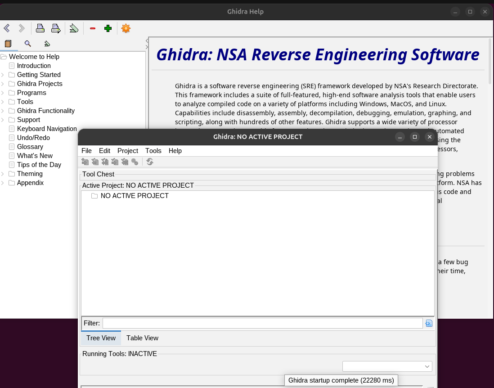
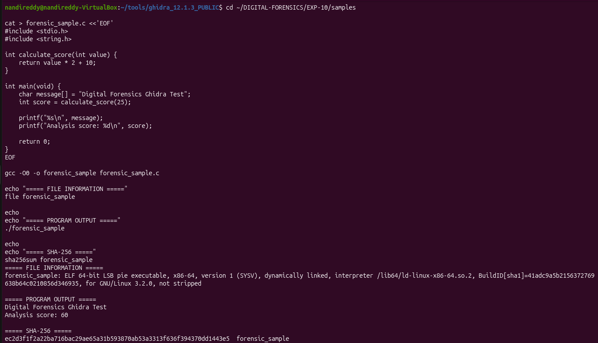
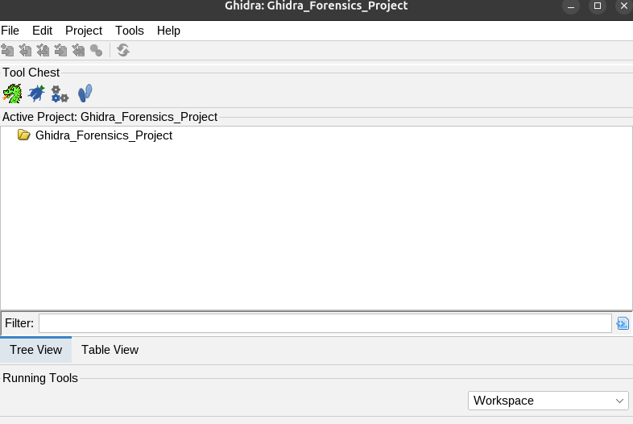
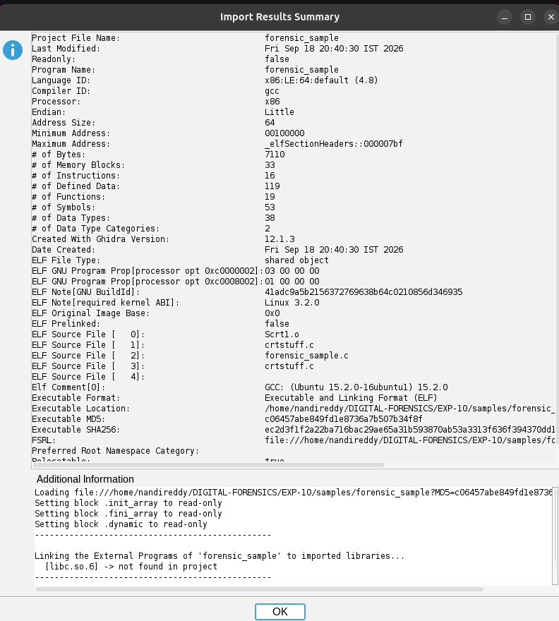
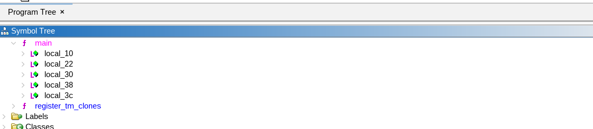
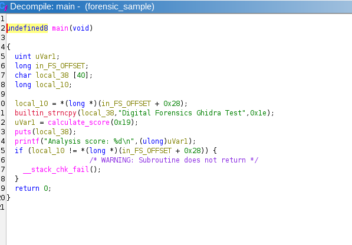
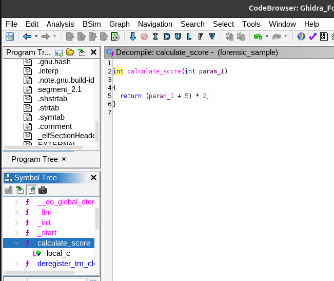
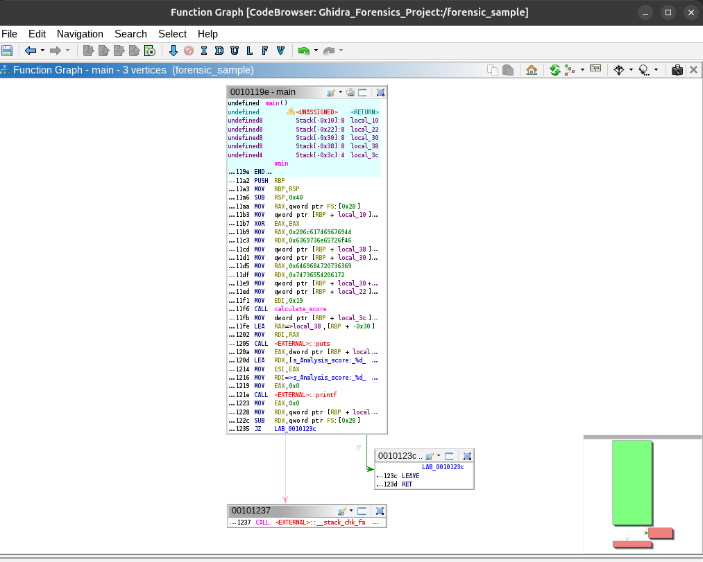
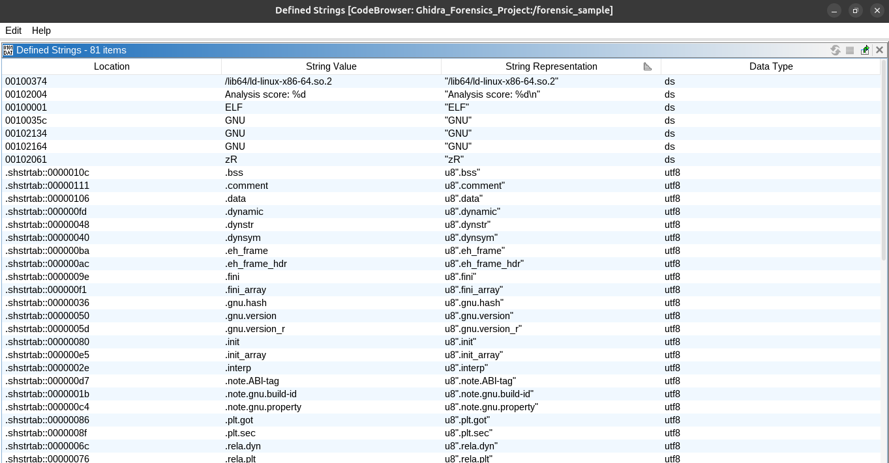
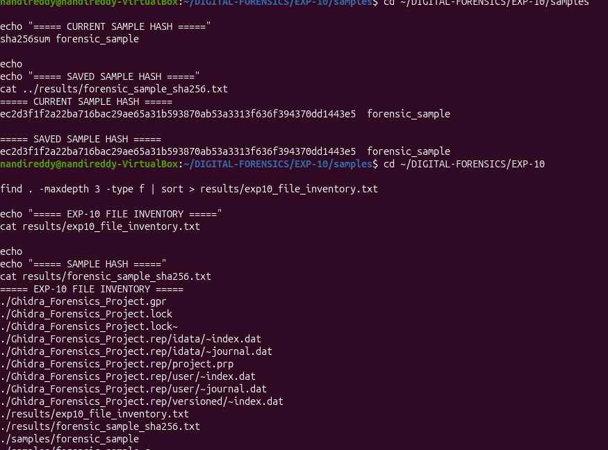

# 🧪 EXPERIMENT 10 — Static Binary Analysis and Reverse Engineering Using NSA Ghidra

---

## 🎯 Objective

To perform safe static binary reverse engineering of a compiled executable program using the NSA Ghidra Software Reverse Engineering (SRE) framework, analyze ELF binary architecture and compiler metadata, examine assembly instructions and control flow graphs (CFG), decompile low-level machine code into high-level C pseudocode (`main` and `calculate_score`), extract embedded string artifacts, and verify cryptographic evidence integrity before and after analysis using SHA-256 hashing.

---

## 🧰 Tools / Requirements

- **Forensic Reverse Engineering Suite**: NSA Ghidra (Version 12.1.3)
- **Runtime Environment**: Java Development Kit (JDK 21 / OpenJDK)
- **Compilation Toolchain**: GNU Compiler Collection (`gcc` Version 15.2.0)
- **Host Operating System**: Ubuntu Linux 24.04 LTS (x86_64) on VirtualBox
- **Archive Verification Reference**: Ghidra 12.1.3 Distribution Archive (SHA-256: `93a5d11a9ad510622acaaf908c556a7b9b764d338e78a7567f3689bf5081fd54`)
- **Analysis Target**: Controlled benign compiled C executable (`forensic_sample`)

---

## 📋 Experiment Scenario

> Controlled laboratory evidence was used for this experiment.

A safe static binary analysis scenario was conducted to reverse engineer a compiled Linux executable using Ghidra. To establish verifiable ground truth and maintain safe laboratory practices, a benign C program (`forensic_sample.c`) containing a modular mathematical scoring function (`calculate_score`), string references (`"Digital Forensics Ghidra Test"`), and format specifiers was compiled into an ELF x86-64 binary. The examiner was tasked with importing the binary into a dedicated Ghidra project, running automated analysis modules, navigating symbol tables, evaluating decompiled pseudocode against ground truth source logic, inspecting control flow graphs, recovering embedded strings, and confirming bitstream integrity via cryptographic SHA-256 hashing.

---

## 🔐 Evidence / Input

- **Source Code Path**: `/home/nandireddy/DIGITAL-FORENSICS/EXP-10/samples/forensic_sample.c`
- **Compiled Target Binary**: `/home/nandireddy/DIGITAL-FORENSICS/EXP-10/samples/forensic_sample`
- **Binary Architecture & Format**:
  - **Format**: ELF 64-bit LSB Position Independent Executable (PIE)
  - **Instruction Set**: x86-64 (Language ID: `x86:LE:64:default (4.8)`)
  - **Compiler**: GCC 15.2.0 (`gcc -O0`)
  - **Build ID**: `41adc9a5b2156372769638b64c0210856d346935`
- **Runtime Ground-Truth Execution Output**:
  ```text
  Digital Forensics Ghidra Test
  Analysis score: 60
  ```
- **Cryptographic Hashes of `forensic_sample`**:
  - **MD5**: `c06457abe849fd1e8736a7b507b34f8f`
  - **SHA-256**: `ec2d3f1f2a22ba716bac29ae65a31b593870ab53a3313f636f394370dd1443e5`

---

## ⚙️ Procedure

### Step 1 — Initializing NSA Ghidra SRE Framework

Ghidra 12.1.3 was launched on the Linux analysis workstation (`nandireddy-VirtualBox`). The initial *Ghidra Help* documentation viewer ("Ghidra: NSA Reverse Engineering Software") and the active project management interface were verified.

```bash
cd ~/tools/ghidra_12.1.3_PUBLIC
./ghidraRun
```



**Observation:**
The Ghidra framework loaded successfully (startup time: `22280 ms`) and initialized the primary Project Manager window with `Active Project: NO ACTIVE PROJECT`.

**Forensic Significance:**
Launching Ghidra in an isolated analysis VM provides a sandboxed environment for inspecting binary code, shared libraries, and metadata structures without risking accidental execution of untested payloads.

---

### Step 2 — Preparing Benign Target Sample, Baseline Compilation, and SHA-256 Hashing

To create a controlled ground-truth binary, `forensic_sample.c` was authored with function `calculate_score(int value)` returning `value * 2 + 10` and `main()` executing the calculation with argument `25` (yielding `60`). The source was compiled with GCC using `-O0` to preserve unoptimized function calls. The executable type was inspected via `file`, executed to record baseline runtime output, and hashed with `sha256sum`.

```bash
cd ~/DIGITAL-FORENSICS/EXP-10/samples
cat > forensic_sample.c <<'EOF'
#include <stdio.h>
#include <string.h>

int calculate_score(int value) {
    return value * 2 + 10;
}

int main(void) {
    char message[] = "Digital Forensics Ghidra Test";
    int score = calculate_score(25);

    printf("%s\n", message);
    printf("Analysis score: %d\n", score);

    return 0;
}
EOF

gcc -O0 -o forensic_sample forensic_sample.c
file forensic_sample
./forensic_sample
sha256sum forensic_sample
```



**Observation:**
The terminal confirmed:
- `file`: `ELF 64-bit LSB pie executable, x86-64, version 1 (SYSV), dynamically linked, ... not stripped`
- Program output:
  ```text
  Digital Forensics Ghidra Test
  Analysis score: 60
  ```
- Computed SHA-256: `ec2d3f1f2a22ba716bac29ae65a31b593870ab53a3313f636f394370dd1443e5`

**Forensic Significance:**
Establishing the ground truth source code and runtime behavior enables exact validation of Ghidra's decompiler outputs and disassembled instruction accuracy. Recording the pre-analysis SHA-256 hash establishes the evidentiary baseline.

---

### Step 3 — Creating Forensic Analysis Project in Ghidra

A dedicated, non-shared forensic project named `Ghidra_Forensics_Project` was created in Ghidra to organize imported binaries, memory maps, symbol databases, and analytical tags.

```text
Action: File -> New Project -> Non-Shared Project -> Project Name: Ghidra_Forensics_Project
```



**Observation:**
The Ghidra project manager initialized active project workspace `Ghidra_Forensics_Project` ready for binary importation.

**Forensic Significance:**
Maintaining dedicated project workspaces isolates case artifacts, preserves analysis databases (`.gpr` and `.rep`), and ensures repeatable forensic investigations.

---

### Step 4 — Ingesting Binary and Analyzing Ingestion Metadata Summary

The target binary `forensic_sample` was imported into `Ghidra_Forensics_Project`. Ghidra automatically parsed the ELF file header and presented the **Import Results Summary** dialog.

```text
Action: File -> Import File -> Select forensic_sample -> Review Import Results Summary
```



**Observation:**
The summary confirmed automated architecture and compiler detection:
- **Project File Name**: `forensic_sample`
- **Language ID**: `x86:LE:64:default (4.8)`
- **Compiler ID**: `gcc`
- **Processor**: `x86` (64-bit Little Endian)
- **Ghidra Version**: `12.1.3`
- **Executable Format**: `Executable and Linking Format (ELF)`
- **GNU BuildID**: `41adc9a5b2156372769638b64c0210856d346935`
- **Compiler Comment**: `GCC: (Ubuntu 15.2.0-16ubuntu1) 15.2.0`
- **Executable MD5**: `c06457abe849fd1e8736a7b507b34f8f`
- **Executable SHA-256**: `ec2d3f1f2a22ba716bac29ae65a31b593870ab53a3313f636f394370dd1443e5`
- **Internal Metrics**: 33 Memory Blocks, 19 Functions, 53 Symbols

**Forensic Significance:**
Ghidra's import metadata extracts critical forensic fingerprints: compiler version, build IDs, dynamic linking requirements (`libc.so.6`), and cryptographic hashes, corroborating binary origin and toolchain provenance.

---

### Step 5 — Symbol Tree Navigation and Function Symbol Enumeration

The binary was opened in the **CodeBrowser** tool and automated analysis was executed. The **Symbol Tree** was navigated under the `Functions` category to identify program entry points, standard library linkage, and user-defined functions.

```text
Action: CodeBrowser -> Symbol Tree -> Functions -> Locate main and local stack variables
```



**Observation:**
The Symbol Tree parsed function `main` along with its allocated stack frame variables (`local_10`, `local_22`, `local_30`, `local_38`, `local_3c`), as well as CRT initialization symbols (`register_tm_clones`).

**Forensic Significance:**
Symbol analysis isolates key subroutines and variable structures. In non-stripped binaries, preserved symbol tables significantly accelerate reverse engineering by linking assembly offsets directly to function names.

---

### Step 6 — Decompiler Pseudocode Analysis of the `main` Function

Function `main` was selected in the Symbol Tree to review Ghidra's reconstructed high-level C pseudocode in the **Decompile** window alongside the assembly disassembly.

```text
Action: Select main in Symbol Tree -> Analyze Decompile Window
```



**Observation:**
Ghidra reconstructed the high-level logic of `main` with remarkable fidelity:
```c
undefined8 main(void)
{
  uint uVar1;
  long in_FS_OFFSET;
  char local_38 [40];
  long local_10;
  
  local_10 = *(long *)(in_FS_OFFSET + 0x28);
  builtin_strncpy(local_38,"Digital Forensics Ghidra Test",0x1e);
  uVar1 = calculate_score(0x19);
  puts(local_38);
  printf("Analysis score: %d\n",(ulong)uVar1);
  if (local_10 != *(long *)(in_FS_OFFSET + 0x28)) {
    __stack_chk_fail();
  }
  return 0;
}
```

**Forensic Significance:**
The decompiler extracted:
1. The literal text `"Digital Forensics Ghidra Test"` copied into stack buffer `local_38`.
2. The function invocation `calculate_score(0x19)` where `0x19` represents decimal `25`.
3. Standard output calls (`puts` and `printf`).
4. Stack canary verification logic (`in_FS_OFFSET + 0x28` / `__stack_chk_fail`), confirming active compiler stack protection.

---

### Step 7 — Static Analysis and Algebraic Decompilation of Subroutine `calculate_score`

Subroutine `calculate_score` was navigated in the Symbol Tree and analyzed in the Decompiler window to inspect its arithmetic reconstruction.

```text
Action: Select calculate_score in Symbol Tree -> Analyze Decompile Window
```



**Observation:**
Ghidra decompiled the subroutine as:
```c
int calculate_score(int param_1)
{
  return (param_1 + 5) * 2;
}
```

**Forensic Significance:**
In the original source code, the function was written as `value * 2 + 10`. The decompiler factored this into `(param_1 + 5) * 2`. Both mathematical expressions are algebraically equivalent:
$$\text{Output} = (25 + 5) \times 2 = 30 \times 2 = 60$$
$$(25 \times 2) + 10 = 50 + 10 = 60$$
Understanding how decompilers and compilers optimize and factor arithmetic expressions is crucial for accurately interpreting reverse-engineered algorithms.

---

### Step 8 — Control Flow Graph (CFG) Visual Analysis in Function Graph

The **Function Graph** window for `main` was opened to inspect the basic block structure, conditional branch targets, and instruction flow.

```text
Action: Window -> Function Graph -> Select main
```



**Observation:**
The Function Graph visualized `main` across 3 vertices (basic blocks):
- **Block 1 (`0010119e`)**: Stack allocation (`SUB RSP, 0x40`), stack canary loading (`MOV RAX, qword ptr FS:[0x28]`), string initialization via 64-bit immediate values (`MOV RAX, 0x206c617469676944` -> `"Digital "`), argument passing (`MOV EDI, 0x19`), calls to `calculate_score`, `puts`, `printf`, and stack canary check (`SUB RDX, qword ptr FS:[0x28]`). It terminates at conditional jump `JZ LAB_0010123c`.
- **Block 2 (`0010123c` - True / Green branch)**: Normal execution path: `LEAVE`, `RET`.
- **Block 3 (`00101237` - False / Red branch)**: Stack corruption handler: `CALL <EXTERNAL>::__stack_chk_fail`.

**Forensic Significance:**
Function graphs map execution flow, identify decision points, locate loop constructs, and highlight security checkpoints (such as stack buffer overflow checks) in an intuitive visual representation.

---

### Step 9 — Extracting Defined Strings and Static Binary Artifacts

The **Defined Strings** table was opened in CodeBrowser to extract embedded string constants, library paths, format strings, and section names from the binary data sections.

```text
Action: Window -> Defined Strings -> Filter and sort string artifacts
```



**Observation:**
The Defined Strings table populated 81 string items, including:
- `00100374`: `/lib64/ld-linux-x86-64.so.2` (ELF Dynamic Linker/Interpreter)
- `00102004`: `Analysis score: %d\n` (Format string)
- `00100001`: `ELF` (Magic header)
- `0010035c`, `00102134`, `00102164`: `GNU` (Compiler / ABI tags)
- Section identifier strings: `.bss`, `.comment`, `.data`, `.dynamic`, `.dynsym`, `.eh_frame`, `.fini`, `.gnu.hash`, `.init`, `.interp`, `.note.gnu.build-id`, `.plt.got`, `.rela.dyn`, `.rodata`

**Forensic Significance:**
String analysis provides immediate intelligence into binary capabilities, runtime output messages, target URLs/IPs, file paths, and external libraries without requiring code execution.

---

### Step 10 — Post-Analysis Cryptographic Integrity Verification

Following the static analysis session, the SHA-256 hash of `forensic_sample` was recalculated in the terminal and compared against the saved reference hash (`results/forensic_sample_sha256.txt`). The complete experiment file inventory was generated into `results/exp10_file_inventory.txt`.

```bash
cd ~/DIGITAL-FORENSICS/EXP-10/samples
echo "===== CURRENT SAMPLE HASH ====="
sha256sum forensic_sample

echo "===== SAVED SAMPLE HASH ====="
cat ../results/forensic_sample_sha256.txt

cd ~/DIGITAL-FORENSICS/EXP-10
find . -maxdepth 3 -type f | sort > results/exp10_file_inventory.txt
echo "===== EXP-10 FILE INVENTORY ====="
cat results/exp10_file_inventory.txt
```



**Observation:**
The current computed SHA-256 hash matched the saved reference hash exactly:
- **Current Sample Hash**: `ec2d3f1f2a22ba716bac29ae65a31b593870ab53a3313f636f394370dd1443e5`
- **Saved Reference Hash**: `ec2d3f1f2a22ba716bac29ae65a31b593870ab53a3313f636f394370dd1443e5`
- **Hash Match**: Identical bitstream match.

**Forensic Significance:**
Static reverse engineering in Ghidra operates entirely on imported representations in the project database without altering the original disk evidence, ensuring pristine evidentiary integrity.

---

## 🔎 Observations

1. Ghidra 12.1.3 initialized and created project workspace `Ghidra_Forensics_Project`.
2. The benign sample `forensic_sample` compiled from `forensic_sample.c` generated runtime output `"Digital Forensics Ghidra Test"` and `"Analysis score: 60"`.
3. Ingestion summary confirmed an ELF 64-bit LSB PIE executable, x86-64 architecture, GCC 15.2.0 compiler ID, MD5 `c06457abe849fd1e8736a7b507b34f8f`, and SHA-256 `ec2d3f1f2a22ba716bac29ae65a31b593870ab53a3313f636f394370dd1443e5`.
4. Ghidra's decompiler reconstructed `main` with the string `"Digital Forensics Ghidra Test"`, call to `calculate_score(0x19)`, and stack canary validation.
5. Decompilation of `calculate_score` revealed the factored arithmetic expression `(param_1 + 5) * 2`, mathematically equivalent to `value * 2 + 10`.
6. The Function Graph partitioned `main` into 3 basic blocks representing entry/computation, normal exit, and `__stack_chk_fail` error handling.
7. Defined Strings extracted 81 items, including interpreter `/lib64/ld-linux-x86-64.so.2` and format string `Analysis score: %d\n`.
8. Post-analysis SHA-256 verification confirmed exact hash parity with the pre-analysis evidence.

---

## 🧠 Forensic Findings & Analysis

- **Decompiler High-Level Recovery Accuracy**: Ghidra successfully recovered program logic, variable assignments, parameter values (`0x19` = 25), and standard I/O function calls (`puts`, `printf`), proving its efficacy for static binary analysis without dynamic execution.
- **Algebraic Compiler/Decompiler Equivalence**: The transformation of `value * 2 + 10` into `(param_1 + 5) * 2` illustrates intermediate compiler optimization and algebraic normalization in decompilation pipelines.
- **Control Flow Graph Structure**: Graph analysis clearly demarcated normal execution pathways from runtime defense traps (stack canary checks), allowing examiners to map execution paths quickly.
- **Artifact Identification Through Defined Strings**: Extracted strings revealed runtime format strings, dynamic linker requirements, and section headers without requiring manual byte searches.
- **Non-Destructive Static Forensic Workflow**: Comparison of pre- and post-analysis SHA-256 hashes proved that static reverse engineering did not modify the evidence file.

---

## 📊 Result

✅ Successfully completed

Static binary reverse engineering was performed on the compiled benign ELF sample using NSA Ghidra 12.1.3. Binary architecture, disassembly instructions, decompiler pseudocode for `main` and `calculate_score`, control flow graphs, and defined strings were analyzed with verified cryptographic SHA-256 integrity.

---

## 📝 Conclusion

NSA Ghidra demonstrated powerful capabilities for static binary reverse engineering and digital forensics investigation. The framework successfully reconstructed high-level pseudocode from compiled x86-64 machine instructions, visualized control flow graphs, extracted embedded string artifacts, and preserved evidence integrity throughout the static analysis process.

---

## 📚 References

- NSA Ghidra Official Documentation & User Guides (ghidra-sre.org).
- Eagle, Chris, and Kara Nance. *The Ghidra Book: The Definitive Guide*. No Starch Press.
- Sikorski, Michael, and Andrew Honig. *Practical Malware Analysis: The Hands-On Guide to Dissecting Malicious Software*. No Starch Press.

